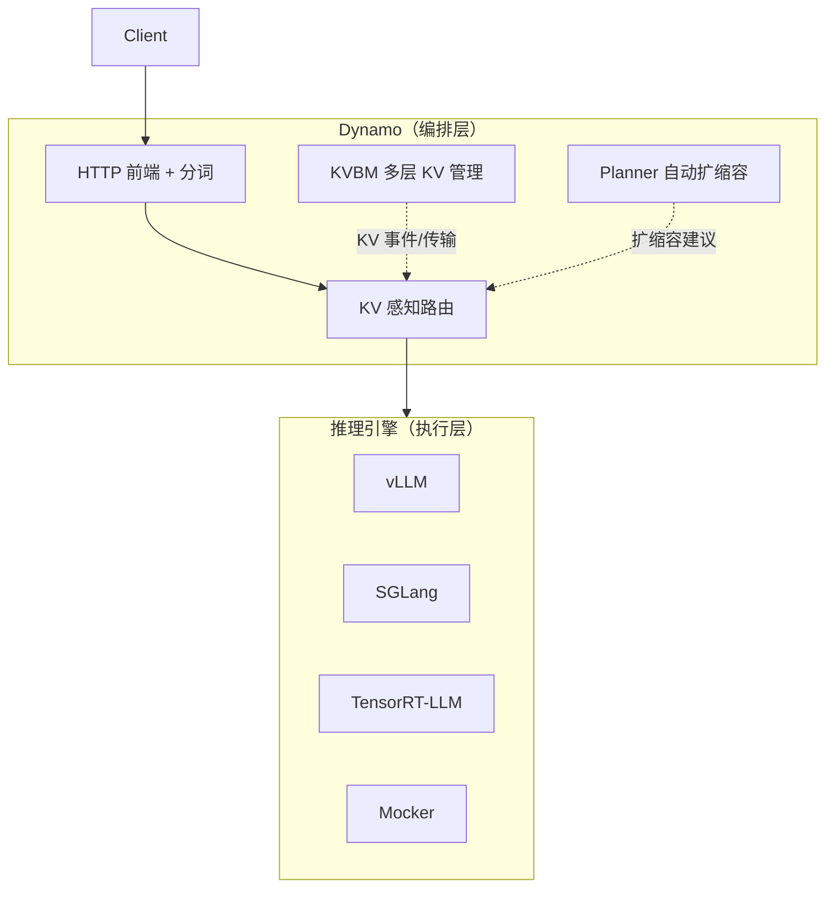

# 第 1 章 · 预备知识：LLM 推理与引擎生态

> **适合谁读**：没系统接触过推理引擎内部机制的读者；只写过调用 OpenAI API 的应用、
> 想往下挖的工程师。
> **前置**：会用 Python，大致知道 Transformer 是什么。
> **耗时**：40 分钟
> **源码锚点**：commit `61e9184`（v1.5.0）。本章无代码走读，主要是概念地基。

**学完能：**
- 说清 prefill 与 decode 两个阶段的算力/带宽特征差异
- 解释 KV cache、PagedAttention、continuous batching、prefix caching、chunked prefill
- 说出 vLLM / SGLang / TensorRT-LLM 三个引擎的定位差异
- 解释"为什么有了引擎还需要一个编排层"——这正是 Dynamo 存在的理由

---

## 1.1 推理的两个阶段

自回归 LLM 生成一个回答的过程分两段：

- **Prefill（预填充）**：把整个 prompt 一次喂入模型，并行计算所有 token 的注意力。
  计算量大、GPU 算力受限（compute-bound），产出是 prompt 的 KV cache。
- **Decode（解码）**：逐个生成 token，每步都要读全部历史 KV cache 再算一个 token。
  计算量小、显存带宽受限（memory-bound），batch 越大带宽利用率越高。

```
延迟视角：  TTFT（首 token 延迟）由 prefill 主导；TPOT/ITL（每 token 延迟）由 decode 主导
吞吐视角：  prefill 吃 FLOPs，decode 吃 HBM 带宽 —— 两类负载对硬件的需求相反
```

这个"相反"就是后面一切故事的起点：把 prefill 和 decode 放在同一个进程、同一批
GPU 上，两者会互相干扰（prefill 一来，在途 decode 的 token 延迟就抖动）。
**分离式服务（disaggregated serving，PD 分离）**因此出现：prefill 与 decode 各自
独立扩缩容，中间通过 KV 传输衔接。Dynamo 把 PD 分离作为一等公民（见 ch14）。

## 1.2 KV cache：推理服务的核心状态

Transformer 自注意力需要每个新 token 看到**所有历史 token 的 Key/Value 投影**。
为了避免重算，这些 K/V 被缓存下来，就是 KV cache。它的规模：

```
KV bytes ≈ 2 × 层数 × KV头数 × 头维 × 序列长 × 精度字节 × batch
```

以 70B 级模型、长上下文为例，KV cache 很容易达到数十 GB / 序列，比模型权重更早
成为瓶颈。由此产生一整族技术，Dynamo 的路由与缓存管理全部围绕它们展开：

| 技术 | 解决什么 | 一句话原理 |
|------|----------|-----------|
| PagedAttention | KV 显存碎片/浪费 | KV 分成固定大小 block，按页表映射（vLLM 论文提出） |
| Continuous batching | 硬 batch 边界低吞吐 | 每步调度粒度到单序列，完成即出、新请求即进 |
| Prefix caching | 共享前缀重复计算 | 相同前缀的 KV block 复用（系统提示词、多轮对话场景收益巨大） |
| Chunked prefill | 长 prompt 饿死 decode | 把长 prefill 切成块，与 decode 混排 |

**对 Dynamo 最关键的一点**：prefix caching 让"某段前缀的 KV 已经在哪个 worker 上"
变成了**路由决策的输入**。同一个系统提示词的请求打到已有该前缀 KV 的 worker，
就能跳过重算——这就是 KV 感知路由（ch10–ch13 整个第三部分）。

## 1.3 KV 的分层

单卡显存装不下所有 KV，于是有了层级：GPU HBM → CPU 内存 → SSD → 远端节点/对象存储。
数据在哪一层、如何跨层与跨节点搬运（通常走 RDMA），决定了命中率和 TTFT。
Dynamo 的 KVBM（KV Block Manager）就是这套多层管理器（ch16）；跨节点搬运依赖
NIXL 库（ch15）。

## 1.4 引擎生态：vLLM / SGLang / TensorRT-LLM

Dynamo 不自己做模型执行，它编排这些引擎：

| 引擎 | 定位 | 备注 |
|------|------|------|
| **vLLM** | 社区事实标准，Python 生态最全 | PagedAttention 发源处；Dynamo 集成最深的引擎（ch17） |
| **SGLang** | 高性能，RadixAttention 前缀缓存 | 结构化输出/Agent 负载常用（ch18） |
| **TensorRT-LLM** | NVIDIA 官方，极致性能 | 面向 NVIDIA 硬件深度优化（ch18） |

三者的共同点：**单实例（或单机多卡）视角**。每个引擎实例管好自己的 KV、调度、
batching。它们假设"请求已经到我这里了"。

## 1.5 为什么需要编排层

一个真实集群里的问题，没有任何单个引擎能回答：

1. **100 个请求进来，发给哪个引擎实例？**——随便发（round-robin）会浪费已缓存的
   前缀；按 KV 前缀命中发（KV-aware routing）能显著降 TTFT、提吞吐。
2. **prefill 集群和 decode 集群之间，KV 怎么搬？**——需要统一的传输层（NIXL）
   和接力协议（PD handoff）。
3. **负载涨了，加几个 prefill、几个 decode？**——需要 SLA 驱动的容量规划（Planner）。
4. **一个 worker 挂了，在途请求怎么办？**——需要在途容错与故障切换。
5. **这一整套东西怎么部署到 K8s？**——需要 Operator 把"推理图"渲染成工作负载。

这五个问题的答案合起来，就是 Dynamo：



> **换引擎不改架构**：Dynamo 把"入口、路由、KV 管理、扩缩容"做成引擎无关的层，
> 后端可以按模型/硬件自由选择 vLLM、SGLang 或 TRT-LLM。

## 1.6 生态里的其他仓库

Dynamo 与一批兄弟仓库协同（引用自仓库根 `AGENTS.md` 的 Ecosystem 表）：

| 仓库 | 角色 | 本书记录处 |
|------|------|-----------|
| [NIXL](https://github.com/ai-dynamo/nixl) | 高吞吐数据传输库（RDMA/NVLink 上的 KV 搬运） | ch15 |
| [AIPerf](https://github.com/ai-dynamo/aiperf) | 基准与负载生成 | ch19 |
| [AISimulate](https://pypi.org/project/aisimulate/) | 离线预测部署配置（不需 GPU 集群） | ch21 |
| [ModelExpress](https://github.com/ai-dynamo/modelexpress) | GPU 到 GPU 流式传权重，加速冷启动 | 提及 |
| [Grove](https://github.com/ai-dynamo/grove) | 拓扑感知的 K8s gang 调度 operator | ch20 |

## 小结

- 推理 = prefill（算力受限）+ decode（带宽受限），两者特征相反，催生 PD 分离。
- KV cache 是核心状态；PagedAttention/前缀缓存等技术让"KV 在哪"变成路由输入。
- 引擎负责单实例执行；Dynamo 负责集群级编排：路由、KV 传输、分层缓存、扩缩容、部署。
- Dynamo 之下的引擎、之上的生态各自独立演进，集成点在第五、六部分展开。

## 自检（4 题，自答）

1. 为什么 prefill 和 decode 放在同一 GPU 上会互相干扰？各自受什么资源限制？
2. prefix caching 存在的前提下，"请求路由到哪个 worker"这个问题发生了什么变化？
3. vLLM/SGLang/TRT-LLM 都是引擎，它们与 Dynamo 的分工边界是什么？
4. `KV bytes ≈ 2 × 层数 × KV头数 × 头维 × 序列长 × 精度 × batch` 里的 2 是哪来的？

## 下一步（跳转推荐）

- 想立刻看到 Dynamo 全貌 → [ch02 Dynamo 是什么](ch02-what-is-dynamo.md)
- 概念都熟，直接进代码 → [ch03 总体架构](ch03-architecture.md)
