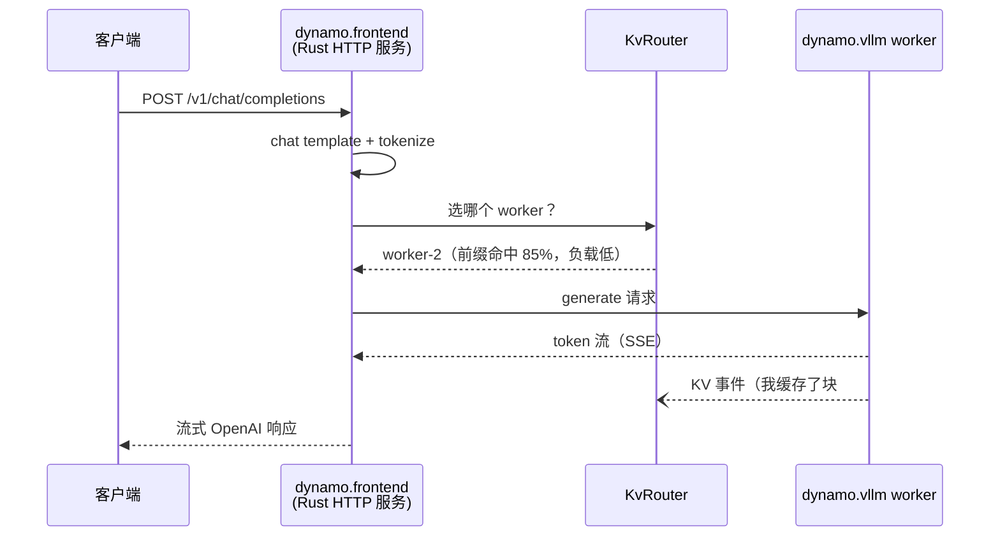

# 第 2 章 · Dynamo 是什么：定位与核心能力

> **适合谁读**：所有人（本书必读）。
> **前置**：ch01。
> **耗时**：25 分钟
> **源码锚点**：commit `61e9184`（v1.5.0）。本章引用的路径均为概览级，细节在各部分展开。

**学完能：**
- 用三句话说清 Dynamo 是什么、不是什么
- 列出六大核心能力并指出各自源码所在的部分
- 避开"版本认知陷阱"（`dynamo serve` 已不存在）

---

## 2.1 一句话定位

**Dynamo 把一个 GPU 集群变成一台协调的推理机**：它是 vLLM / SGLang /
TensorRT-LLM 之上的分布式编排层，负责请求入口、KV 感知路由、KV 跨层跨节点
管理、分离式服务、自动扩缩容和 K8s 部署。

它**不是**：

- 不是推理引擎（不执行模型前向计算，不实现 attention kernel）
- 不是模型格式/量化方案
- 不是简单的反向代理——路由决策依赖集群内所有 worker 的 KV 状态

## 2.2 六大核心能力

### ① 分离式 Prefill/Decode 服务（disaggregated serving）

prefill 池与 decode 池独立部署、独立扩缩容；请求先到 prefill worker 算完
prompt 的 KV，再"接力"到 decode worker 继续生成，KV 通过 NIXL（RDMA/NVLink）
传输。相关代码：`lib/kv-router/src/worker_type.rs`（角色定义）、
`lib/llm/src/kv_router/prefill_router/`（接力路由）、
`components/src/dynamo/vllm/kv_connector_protocols.py`（vLLM 侧传输参数）。
→ **ch14、ch15**

### ② KV 感知路由（KV-aware routing）

worker 处理完请求会发布"我缓存了哪些 token 前缀"的事件；路由器维护全局前缀
索引（radix tree），新请求按**前缀命中度 + 负载**选 worker，命中即省去重算。
相关代码：`lib/kv-router/src/indexer/`（索引）、`lib/llm/src/kv_router.rs`
（`KvRouter`，532 行）、`lib/llm/src/kv_router/publisher/mod.rs`
（`KvEventPublisher`，195 行）。→ **ch10–ch13**

### ③ 多层 KV 缓存管理（KVBM：GPU → CPU → SSD → 远端）

KVBM（KV Block Manager）栈管理 KV block 在显存、内存、SSD、远端之间的放置、
驱逐与搬运，让"cache 容量"不再等于"显存容量"。相关代码：`lib/kvbm-logical/`
（逻辑记账）、`lib/kvbm-physical/`（内存布局与传输）、`lib/kvbm-engine/`
（引擎编排）。→ **ch16**

### ④ SLA 驱动的自动扩缩容（Planner）

按 SLO（如 P99 TTFT）与负载预测，规划该加多少 prefill/decode 副本。
相关代码：`components/src/dynamo/planner/`（核心）、
`components/src/dynamo/global_planner/`（K8s 级编排）。→ **ch21**

### ⑤ 在途容错

worker 挂掉时在途请求的处理与恢复，而不是整池丢弃。相关代码：
`lib/kv-router/src/recovery/`、`tests/fault_tolerance/`。→ **ch13、ch21**

### ⑥ Kubernetes Operator

`DynamoGraphDeployment`（DGD）CRD 描述一张"推理组件图"，Operator 把它渲染成
实际的 K8s 工作负载（每个组件就是一个 `python -m dynamo.<name>` 进程）。
相关代码：`deploy/operator/`。→ **ch20**

## 2.3 三层技术栈

| 层 | 语言/形态 | 位置 | 职责 |
|----|-----------|------|------|
| Rust 核心 | Cargo workspace（20+ crate） | `lib/` | 运行时、传输、HTTP 前端、路由、KVBM |
| Python 扩展层 | `ai-dynamo` wheel（PyO3 绑定） | `components/src/dynamo/` | 组件 CLI 入口、后端集成、Planner |
| K8s 层 | Go operator + Helm | `deploy/` | DGD 渲染、网关、可观测性 |

注意一个反直觉的事实：**HTTP 前端服务器在 Rust 里**（`lib/llm/src/http/`），
Python 的 `dynamo.frontend` 只是个薄入口（ch09 会走读这条链路）。

## 2.4 版本认知陷阱（重要）

Dynamo 的使用方式在 0.x → 1.x 之间发生了根本变化：

| | 0.x（网上旧资料） | 1.5.0（本书） |
|---|------------------|---------------|
| 启动方式 | `dynamo serve graph.yaml` 一次拉起整图 | 每个组件独立进程：`python -m dynamo.frontend`、`python -m dynamo.vllm`… |
| 部署方式 | — | K8s 上由 Operator 从 DGD 渲染；本地用 `examples/*/launch/*.sh` 脚本 |
| 协议类型 crate | `lib/api` | 无此 crate；协议来自外部 crate `dynamo-protocols` / `dynamo-parsers` |

读任何博客/教程，先看它引用的版本。判断标准很简单：出现 `dynamo serve`
即过时。

## 2.5 一个请求的鸟瞰图

后面九章会逐段放大这张图，这里先建立整体印象（一个聚合部署、无 PD 分离的
最简情形）：

## 小结

- Dynamo = 引擎之上的编排层：入口、KV 感知路由、KVBM、PD 分离、Planner、Operator。
- 六大能力各有明确源码归属，本书第三~六部分逐一展开。
- 1.5.0 的入口是 `python -m dynamo.<component>`；`dynamo serve` 已成历史。

## 自检（3 题，自答）

1. Dynamo 和 vLLM 的分工边界是什么？Dynamo 里有一行 attention kernel 代码吗？
2. "KV 感知路由"感知的是什么？这个信息从哪来、存在哪、怎么用？（三段式回答）
3. 同事给你一篇讲 `dynamo serve` 的教程，你怎么判断它是否还适用？

## 下一步（跳转推荐）

- → [ch03 总体架构：三层栈](ch03-architecture.md)
