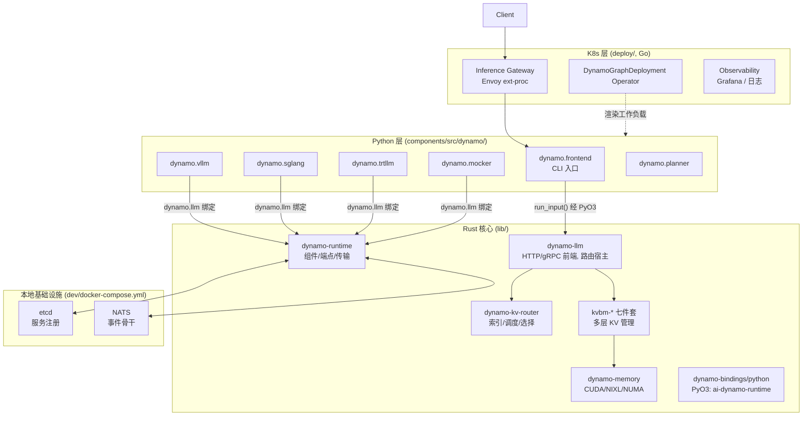
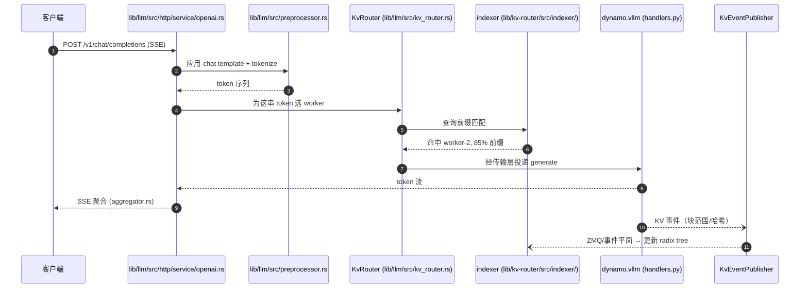

# 第 3 章 · 总体架构：三层栈

> **适合谁读**：所有人（本书必读）。
> **前置**：ch02。
> **耗时**：35 分钟
> **源码锚点**：commit `61e9184`（v1.5.0）。

**学完能：**
- 画出 Dynamo 的分层架构图并标出每层的代表 crate/包
- 说清一个请求穿过哪些模块、KV 事件走哪条反向通路
- 解释"控制面 / 数据面 / 事件面"在 Dynamo 里分别由什么承担

---

## 3.1 全景图

三层的职责与边界：

| 层 | 形态 | 关键事实 |
|----|------|----------|
| Rust 核心 | `lib/` 下 20+ crate 的 Cargo workspace | 性能敏感路径全在这：HTTP 服务器、路由、索引、传输、KVBM |
| Python 层 | `components/src/dynamo/` 各子包 | 每个 `python -m dynamo.<name>` 对应一个组件进程；通过 PyO3 绑定调 Rust |
| K8s 层 | `deploy/operator`（Go）+ Helm + 网关 | 不跑推理逻辑，只负责"把组件图变成工作负载" |

`lib/bindings/python` 是层间的桥：它编译成 `dynamo._core` 扩展，Python 侧的
`dynamo.runtime` / `dynamo.llm` 命名空间实际来自这里（不是 `components/` 下）。

## 3.2 请求面、事件面、控制面

Dynamo 的通信可以按用途分成三类通路，初学者最容易混：

### 请求面（数据面）：请求与 token 流

- 入口：`lib/llm/src/http/service/openai.rs`（OpenAI 兼容路由与处理器，
  约 9000 行，含 chat completions / completions / 聚合）
- 下行：`lib/runtime/src/transports/tcp.rs`、`transports/zmq.rs`、`transports/nats.rs`
  ——组件间高吞吐请求/响应平面
- 出口：后端 worker（如 `components/src/dynamo/vllm/handlers.py`）的 generate 循环

### 事件面：KV 事件

- worker 侧发布：`lib/llm/src/kv_router/publisher/mod.rs`（`KvEventPublisher`，195 行）
- 传输：ZMQ / NATS 事件平面（`lib/runtime/src/transports/event_plane/`、
  `lib/kv-router/src/zmq_wire/`）
- 消费：索引服务 `lib/kv-router/src/services/indexer/server.rs` → radix tree

### 控制面：注册与发现

- etcd：服务注册表（`lib/runtime/src/transports/etcd.rs` 及其 `etcd/` 子模块）
- 发现：`lib/llm/src/discovery/watcher.rs`（`ModelWatcher` 监视 worker 注册、
  构建路由表与 tokenizer 映射）

> **记忆法**：请求面搬 token，事件面搬"谁缓存了什么"，控制面搬"谁还活着"。

## 3.3 Rust 核心里的关键 crate

完整清单见根 `Cargo.toml` 的 `[workspace] members`，这里是阅读优先级：

| crate | 路径 | 一句话 |
|-------|------|--------|
| `dynamo-runtime` | `lib/runtime/` | 组件/端点抽象、四种传输、服务发现——分布式地基 |
| `dynamo-llm` | `lib/llm/` | HTTP/gRPC 前端、协议（`Nv*` 类型）、KV 路由宿主、预处理器 |
| `dynamo-kv-router` | `lib/kv-router/` | 前缀索引（radix/cuckoo）、调度策略、worker 选择——路由的大脑 |
| `kvbm-*`（7 个） | `lib/kvbm-*/` | KV Block Manager：逻辑/物理/引擎/内核/配置/整合器 |
| `dynamo-memory` | `lib/memory/` | 设备内存：arena、pinned CPU、CUDA 池、NIXL agent、NUMA |
| `dynamo-tokens` | `lib/tokens/` | token block 工具与 token 级 radix |
| `dynamo-kv-hashing` | `lib/kv-hashing/` | KV 身份：Blake3 block/token 哈希 |
| `dynamo-mocker` | `lib/mocker/` | 假引擎（测试/压测） |
| `dynamo-backend-common` | `lib/backend-common/` | 后端集成共享脚手架（含 disagg 角色参数） |
| `dynamo-sidecar-*` | `lib/sidecar/{vllm,sglang,trtllm}` | 引擎原生 API ↔ Dynamo 的 Rust 边车 |

> 注意：协议类型（请求/响应结构）不在仓库内，来自 crates.io 的
> `dynamo-protocols` / `dynamo-parsers`。别在 `lib/` 里找 `api` crate。

## 3.4 Python 层组件一览

`components/src/dynamo/` 下每个子包 = 一个可独立启动的组件
（`python -m dynamo.<包名>`）：

| 包 | 角色 |
|----|------|
| `frontend/` | HTTP/gRPC/交互式入口（薄壳，服务器在 Rust） |
| `router/` | 独立的、后端无关 KV 感知路由服务 |
| `vllm/` `sglang/` `trtllm/` | 三大引擎的 worker 集成 |
| `mocker/` | 假后端（开发、压测、CI） |
| `planner/` `global_planner/` | 容量规划与 K8s 级编排 |
| `global_router/` | 跨池/全局路由 |
| `profiler/` | SLA 剖析工具 |
| `kv_state_agent/` `kv_dc_relay/` | KV 状态代理 / 跨数据中心 KV 中继 |
| `common/` | 后端共享配置与协议工具 |

## 3.5 把第 2 章的鸟瞰图放大：模块级时序

聚合模式下（无 PD 分离），一次流式请求的完整路径：

后续章节逐一放大每个编号环节：②③ 在 ch09，④⑤ 在 ch12，⑥⑦ 在 ch17，
⑧⑨ 在 ch10。

## 小结

- 三层栈：Rust 核心（性能路径）/ Python 组件（入口与集成）/ K8s（部署），
  由 PyO3 绑定缝合。
- 三条通信通路：请求面（token 流）、事件面（KV 事件）、控制面（etcd 发现）。
- 关键 crate 分工：runtime 是地基、llm 是脸面、kv-router 是大脑、kvbm 是仓库。

## 自检（4 题，自答）

1. HTTP 服务器跑在 Python 还是 Rust？`dynamo.frontend` 这个 Python 包做了什么？
2. KV 事件从 worker 到 radix tree 索引，中间经过哪些模块？走的是哪条通路？
3. `dynamo-protocols` 是仓库里的哪个 crate？—— trick 题。
4. 请求面为什么需要 TCP/ZMQ/NATS 三种传输，而控制面只用 etcd？

## 下一步（跳转推荐）

- → [ch04 仓库地图与代码地标](ch04-repo-map.md)（把本章的路径变成你的导航图）
- → [ch09 前端入口](../02-core/ch09-frontend-entry.md)（直接进入请求主线）
