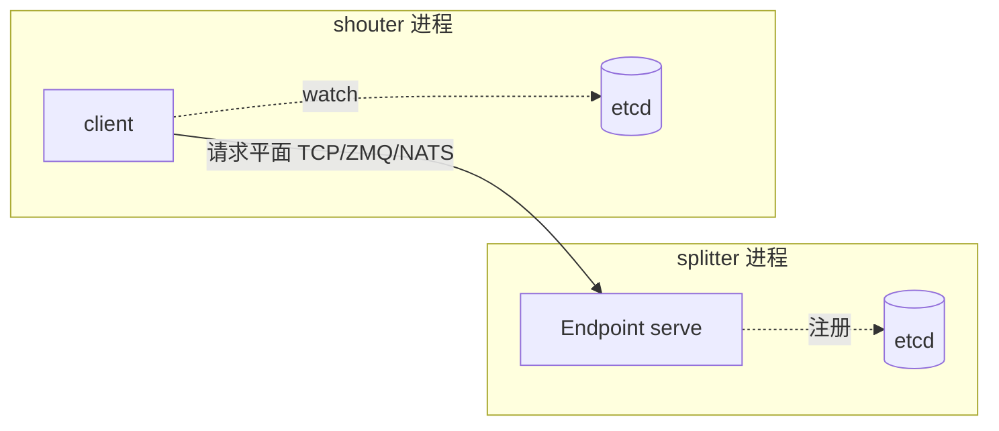

# 第 6 章 · Runtime：组件、端点与命名空间

> **适合谁读**：所有读者（第二部分必读）。
> **前置**：ch05 跑过 hello_world。
> **耗时**：35 分钟
> **源码锚点**：commit `61e9184`（v1.5.0）。

**学完能：**
- 解释 `namespace.component.endpoint` 三元组的语义与 etcd 注册的关系
- 读懂 `serve_endpoint` / `client` 的调用侧代码，自己写一个两组件流水线
- 说清 Python `DistributedRuntime` 与 Rust `Runtime` 的对应关系

---

## 6.1 抽象总览

Dynamo 的分布式编程模型只有一个核心概念对：**组件（Component）是部署单元，
端点（Endpoint）是通信端点**。源码在：

```
lib/runtime/src/runtime.rs               # Runtime（真身）
lib/runtime/src/worker.rs                # Worker：在 runtime 上跑 async fn
lib/runtime/src/component/component.rs   # Component
lib/runtime/src/component/endpoint.rs    # Endpoint（服务侧）
lib/runtime/src/component/client.rs      # client（调用侧）
lib/runtime/src/component/service.rs     # Service
```

Python 侧的 `DistributedRuntime` / `dynamo_worker` / `dynamo_endpoint` 装饰器
来自 `lib/bindings/python/rust/lib.rs` 暴露的 `dynamo._core`，薄封装到
`lib/bindings/python/src/dynamo/runtime/`。

## 6.2 命名三元组

`runtime.endpoint("hello_world.backend.generate")` 拆开：

| 段 | 语义 | etcd 里的体现 |
|----|------|---------------|
| `namespace` | 部署边界（一个集群/一套部署共享） | 注册 key 的顶层前缀 |
| `component` | 一个进程内的一组端点（≈服务名） | key 的中段；frontend、vllm worker 各占一个 |
| `endpoint` | 具体可调用入口（≈方法名） | key 的末段，附带实例/传输地址 |

关键性质：**调用方只写名字，不写地址**。地址由 etcd 注册表 + watcher 动态解析
（ch08）。这让"加一个 worker 副本"对调用方零感知——也是 K8s 上弹性扩缩容
（ch20）能成立的前提。

## 6.3 服务侧：serve_endpoint

hello_world 里的两步：

```python
@dynamo_worker()
async def worker(runtime: DistributedRuntime):
    endpoint = runtime.endpoint("hello_world.backend.generate")
    await endpoint.serve_endpoint(content_generator)
```

发生的事情（按序）：

1. `@dynamo_worker()` 拿到 `Runtime`（Rust `lib/runtime/src/runtime.rs` 的
   PyO3 包装），初始化传输与 etcd 连接。
2. `runtime.endpoint(...)` 构造 `Endpoint` 句柄——**这一步不产生网络副作用**。
3. `serve_endpoint(fn)` 才真正：注册到 etcd（带 lease，进程死 key 自动消失）、
   开始在请求平面上收请求、把收到的请求逐个喂给 `fn`。
4. `fn` 是 async generator → 每个 yield 变成一条流式响应消息。

## 6.4 调用侧：client

`examples/bindings`（`lib/bindings/python/examples/`）里有成对示例
（`hello_world`、`pipeline`、`openai_service`…）。调用范式：

```python
endpoint = runtime.namespace("hello_world").component("backend").endpoint("generate")
client = await endpoint.client()
async for chunk in client.generate("world, dynamo"):
    print(chunk)            # "Hello world!" ... "Hello dynamo!"
```

要点：

- `client` 是**粘性**的：解析一次地址后绑定实例集合，运行期随注册表变化更新。
- 流式输入/输出都支持（`push_egress` 相关绑定在
  `lib/bindings/python/rust/push_egress.rs`）。
- 类型标注 `@dynamo_endpoint(str, str)` 决定序列化方式；不匹配会在边界报错，
  而不是深跑之后静默错。

## 6.5 一个两组件流水线（练习）

目标：`splitter` 组件把句子拆词，`shouter` 组件把每个词大写并流回。骨架：

```python
# splitter.py —— 服务侧 + 调用侧（它在中间，既收也发）
@dynamo_endpoint(str, str)
async def split(request: str):
    for word in request.split(","):
        yield word

@dynamo_worker()
async def worker(runtime: DistributedRuntime):
    ep = runtime.endpoint("pipe.splitter.split")
    await ep.serve_endpoint(split)          # 对上游提供服务

    shout = runtime.endpoint("pipe.shouter.shout")
    client = await shout.client()           # 对下游发起调用
    ...
```

写完 `shouter.py` 后三个终端分别起 etcd/NATS、splitter、shouter，再写个 10 行
客户端验证。做完这个练习，你对"组件=进程、端点=信道"的体感会超过读十遍文档。

## 6.6 Runtime 与 Worker（Rust 侧）

- `lib/runtime/src/runtime.rs`：`Runtime` 持有传输栈与发现客户端；Python
  `DistributedRuntime` 的每个方法几乎都能在这里找到 `pub fn` 对应。
- `lib/runtime/src/worker.rs`：`Worker` 是"拿 runtime 跑一个 async 主循环"的
  包装（`execute_async`），处理优雅退出、任务编排。
- 生命周期：进程退出 → etcd lease 过期 → 注册消失 → 各 watcher 收到删除事件
  → 路由表收缩。**没有"注销"这个显式动作**。



## 小结

- 组件/端点 + 三元组命名 = Dynamo 的"微服务 SDK"；etcd 是名字的真相源。
- `serve_endpoint` 三件事：注册、收请求、喂给 async generator。
- client 粘性解析、流式双向、类型在边界校验。

## 自检（4 题，自答）

1. 调用方写死 IP 吗？worker 副本从 1 加到 8，调用方代码要改吗？为什么？
2. `runtime.endpoint(...)` 与 `serve_endpoint(...)` 哪个产生 etcd 副作用？
3. 进程被 `kill -9`，它的注册记录多久消失、靠什么机制？
4. `@dynamo_endpoint(str, str)` 两个类型参数分别约束什么？

## 下一步（跳转推荐）

- → [ch07 传输四平面](ch07-transports.md)（端点之间的字节怎么走）
- → [ch08 服务发现](ch08-discovery.md)（watcher 如何驱动路由表）
