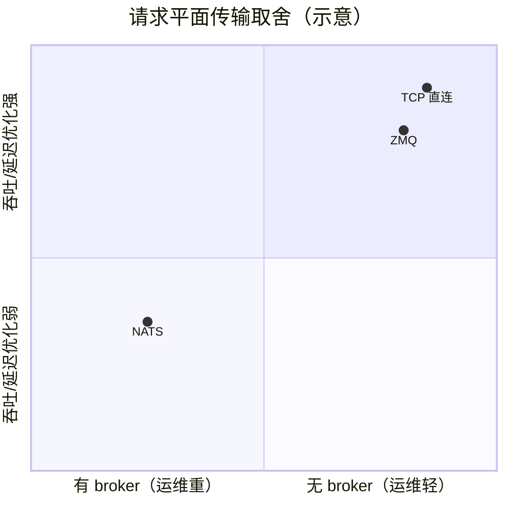

# 第 7 章 · 传输四平面：etcd / NATS / TCP / ZMQ

> **适合谁读**：想理解性能特征与运维排障的读者。
> **前置**：ch06。
> **耗时**：30 分钟
> **源码锚点**：commit `61e9184`（v1.5.0）。

**学完能：**
- 说出四种传输各自的用途与取舍
- 解释"事件平面可插拔（NATS 或 ZMQ）"的设计原因
- 根据故障现象判断该查哪条平面

---

## 7.1 为什么有四种

Dynamo 的通信需求差异极大：注册信息一天变几百次，token 流每秒百万条，
KV 事件是高频小消息。一种传输通吃必然次优，于是：

| 传输 | 源码 | 承载 | 特征 |
|------|------|------|------|
| **etcd** | `lib/runtime/src/transports/etcd.rs` + `etcd/{connector,kv,lease,lock}.rs` | 控制面：注册、发现、分布式锁 | 强一致、低频、少量数据 |
| **NATS** | `lib/runtime/src/transports/nats.rs` | 请求平面的可选项 + 事件骨干 | pub/sub，部署简单 |
| **TCP** | `lib/runtime/src/transports/tcp.rs` | 请求平面主力 | 点对点高吞吐 |
| **ZMQ** | `lib/runtime/src/transports/zmq.rs` | 请求平面 + KV 事件平面 | 无 broker、低延迟 |

## 7.2 控制面：etcd

etcd 在 Dynamo 里的三件事：

1. **注册表**：`namespace/component/endpoint` → 实例地址（ch06/08）。
2. **lease 保活**：进程持 lease，心跳断了 key 自动过期——故障检测的根基。
3. **锁与协调**：`etcd/lock.rs`（选主类场景，如某些单例服务）。

排障入口：`etcdctl get --prefix ""` 看当前注册了哪些组件；
lease TTL 决定 worker 崩溃后多久"消失"。

## 7.3 请求平面：TCP / ZMQ / NATS

端点客户端实际走哪条，取决于部署配置。三者的取舍：

- **TCP 直连**：地址从 etcd 解析后点对点连接，路径最短，大 payload（embedding、
  多模态）友好。
- **ZMQ**：无 broker 的消息库，低延迟；同时被 KV 事件平面复用（`zmq_wire`）。
- **NATS**：默认事件骨干，也承载部分请求；`dev/docker-compose.yml` 里把
  `max_payload` 调到 15MB 就是为了让大 embedding 能过（Base64 后 ~13.3MB）。

> 读代码提示：`lib/runtime/src/transports/` 下每个文件就是一个传输实现；
  抽象层在 endpoint/client 的分发逻辑里。配置旗标（如 `--kadet-concurrency`、
  传输选择）分散在各组件 args 里，搜 `nats`/`zmq`/`tcp` 关键字定位。

## 7.4 事件平面：可插拔的 KV 事件通路

`lib/runtime/src/transports/event_plane/` 把"KV 事件怎么广播"做成可插拔
（NATS 或 ZMQ）。为什么单独抽象？

1. **规模**：每个 worker 每步都可能发事件（缓存了哪些块、序列状态），
   频率远高于请求；量和请求面不同量级。
2. **可靠性语义不同**：事件丢了可以靠重建/对账恢复（ch10 讲 indexer 的
   修复机制），不需要请求面的 exactly-once。
3. **部署形态不同**：大集群倾向独立 ZMQ 通路，避免和请求抢 NATS。

线格式（消息长什么样）定义在 `lib/kv-router/src/zmq_wire/`——这是 worker 与
indexer 之间的契约，ch10 会拆一条真实消息。

## 7.5 端到端对照

| 你看到的现象 | 走的平面 | 排查 |
|--------------|----------|------|
| worker 起了但收不到请求 | 控制面（没注册上） | etcd key、lease |
| 请求 hang，CPU 空 | 请求平面（地址解析/连接失败） | 传输配置、防火墙 |
| 路由命中率异常低 | 事件平面（KV 事件没到 indexer） | ZMQ/NATS 订阅、indexer 日志 |
| 大 embedding 请求报 payload 超 | NATS `max_payload` | `dev/docker-compose.yml` 注释 |

## 小结

- 四传输按"控制/请求/事件"三类通路分工，别用一张图套所有流量。
- etcd 提供名字与生死；TCP/ZMQ 搬 token；事件平面可插拔且允许尽力而为语义。
- 排障先分类通路，再进对应源码文件。

## 自检（4 题，自答）

1. NATS 的 `max_payload` 为什么要调到 15MB？哪个场景会撞上限？
2. KV 事件为什么可以接受"尽力而为"而请求不行？丢失后系统怎么自愈？
3. `kill -9` 一个 worker：哪条平面最先反映出变化？各平面分别发生什么？
4. `lib/kv-router/src/zmq_wire/` 定义的是哪两方之间的契约？

## 下一步（跳转推荐）

- → [ch08 服务发现与 Worker 生命周期](ch08-discovery.md)
- → [ch10 KV 事件与发布订阅](../03-kv-routing/ch10-kv-events.md)
