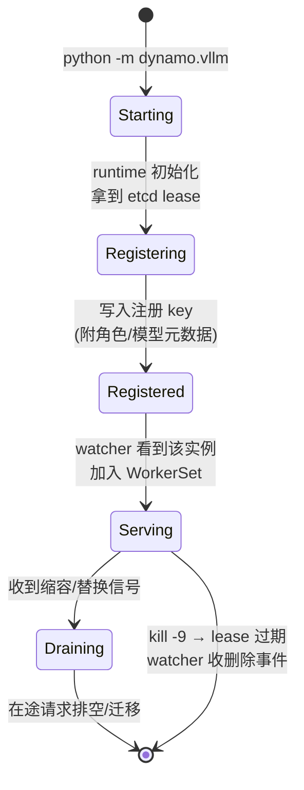

# 第 8 章 · 服务发现与 Worker 生命周期

> **适合谁读**：所有读者；做运维/排障的必读。
> **前置**：ch06、ch07。
> **耗时**：35 分钟
> **源码锚点**：commit `61e9184`（v1.5.0）。

**学完能：**
- 描述 worker 从启动到可服务、再到退出/崩溃的完整状态机
- 讲清 `ModelWatcher` 如何把注册表变化变成路由表与 tokenizer 映射
- 定位"扩容不生效 / 缩容残留"类问题的检查点

---

## 8.1 三个源码地标

```
lib/runtime/src/discovery/mod.rs            # 发现抽象
lib/runtime/src/discovery/registration.rs   # 注册（etcd lease）
lib/runtime/src/discovery/kube.rs           # kube 形态
lib/llm/src/discovery/watcher.rs            # ModelWatcher：LLM 域的监视器
lib/llm/src/discovery/allocator.rs          # worker 池分配
lib/llm/src/discovery/controller.rs         # 池控制
lib/llm/src/discovery/worker_set.rs         # WorkerSet：当前可用集合
lib/llm/src/discovery/worker_monitor.rs     # 健康监视
```

通用层（runtime）只管"名字 → 地址"；LLM 域层（`lib/llm/src/discovery/`）在
其上叠加了模型语义：worker 是谁的、什么角色（prefill/decode）、tokenizer 用哪个。

## 8.2 生命周期状态机



两个关键机制：

1. **注册即心跳**：没有独立的心跳线程，lease 保活就是心跳。TTL 内没有
   renew，key 消失——`kill -9` 与优雅退出对系统的影响收敛为同一条路径。
2. **元数据随注册走**：worker 把 `WorkerType`、模型名、能力标签写进注册值，
   watcher 不需要二次询问。这也是 vLLM worker 在
   `components/src/dynamo/vllm/main.py` 启动时声明 worker-type 的原因（ch17）。

## 8.3 ModelWatcher：注册表 → 路由表

`lib/llm/src/discovery/watcher.rs` 的 `ModelWatcher` 是前端的"人事部门"：

1. watch etcd 上本 namespace 的组件注册变化；
2. 解析每个 worker 的元数据（模型、角色、端点地址）；
3. 维护/触发更新：
   - **路由表**（哪个模型的请求可以发给谁——交给 `WorkerSet` 与
     `lib/llm/src/discovery/{allocator,controller}.rs`）；
   - **tokenizer 映射**（前端对每个模型用对应 tokenizer 分词，配合
     `lib/llm/src/hub.rs` 的本地模型/HF 解析）；
   - 下游 KV 侧的 worker 指标订阅（ch12 的负载输入）。

> 注意一个容易忽略的耦合：**前端分词的正确性依赖发现层**。tokenizer 错了，
> 路由的"前缀"就错了——这不是文本问题，是路由正确性问题。

## 8.4 扩容与缩容的端到端效应

以"vLLM worker 从 2 副本扩到 4"为例：

| 步骤 | 位置 | 可观察点 |
|------|------|----------|
| 新 Pod 启动，进程起来 | K8s / 本地终端 | 进程日志 |
| 注册写入 etcd | `discovery/registration.rs` | etcd key 多了两条 |
| watcher 收到 put 事件 | `watcher.rs` | frontend 日志"worker joined" |
| WorkerSet 更新 | `worker_set.rs` | 路由可选集合 +2 |
| KV 指标流接入 | ch12 | 新 worker 负载从 0 开始计入 |

缩容多一步"排空"：`worker_monitor.rs` 与 K8s 的 terminationGracePeriod 配合，
在 lease 消失前尽量让在途请求完成（在途容错的完整故事在 ch13/ch21）。

**扩容不生效检查清单**：etcd 里有没有新 key（没有→注册问题）→ frontend 日志
有没有 join（没有→watcher/网络分区）→ 路由有没有把流量分过去（没有→选择器
策略/负载指标未接入，见 ch12）。

## 8.5 与 K8s Operator 的分工

`deploy/operator/` 不直接参与运行期发现：它把 DGD 渲染成 Deployment/Pod
（ch20），Pod 里的进程再走本章的 etcd 注册。也就是说：

- **K8s 管进程的有无**（副本数、重启）；
- **etcd/watcher 管服务视角的生死**（能不能接流量）。

两层不一致的窗口（Pod 在但未注册 = 还在 Starting；Pod 没了但 key 未过期 =
lease TTL 未到）正是很多"看起来扩了但没流量"问题的根源。

## 小结

- 生命周期 = 注册(lease) → 被 watch → 进 WorkerSet → 服务 → 排空/过期。
- `ModelWatcher` 同时驱动路由表与 tokenizer 映射，是前端的依赖中枢。
- 排障框架：etcd 有无 key → watcher 有无事件 → 选择器有无采纳。

## 自检（4 题，自答）

1. 为什么不需要独立心跳机制？lease TTL 设置过长/过短分别有什么后果？
2. tokenizer 映射为什么属于"发现"层的职责？
3. Pod Running 但收不到流量，列出至少三个可能断点及各自的验证方法。
4. K8s 副本数和 etcd 注册数什么情况下会不一致？这个窗口意味着什么？

## 下一步（跳转推荐）

- → [ch09 前端入口](ch09-frontend-entry.md)（watcher 的消费方之一）
- → [ch20 Operator 与 DGD](../06-deploy/ch20-operator-dgd.md)（另一层"生死"）
