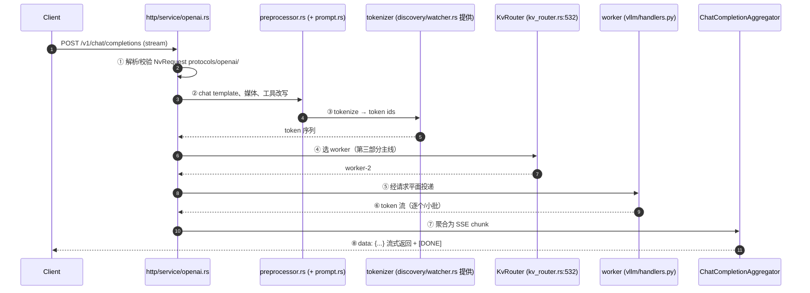

# 第 9 章 · 前端入口：一次 HTTP 请求的完整旅程

> **适合谁读**：所有读者（源码主线第一章）。建议开着编辑器跟读。
> **前置**：ch03、ch06、ch08。
> **耗时**：50 分钟
> **源码锚点**：commit `61e9184`（v1.5.0）。

**学完能：**
- 从 `python -m dynamo.frontend` 开始，逐层指出代码如何走到 Rust HTTP 服务器
- 拆解一次流式 chat completion 经过的前处理、路由、聚合各阶段
- 知道该在哪些文件下断点/加日志来调试前端行为

---

## 9.1 启动链路：Python 壳 → Rust 芯

```
components/src/dynamo/frontend/__main__.py
  └─ frontend/main.py :: main()                     # 495 行（已核验）
       ├─ uvloop.run(async_main())
       └─ async_main():
            ├─ 构建 DistributedRuntime（PyO3 → lib/runtime）
            ├─ build_router_config(config)           # frontend_args.py
            ├─ EntrypointArgs(EngineType.Dynamic, **kwargs)
            ├─ engine = await make_engine(runtime, e)
            │     └─ lib/bindings/python/rust/llm/entrypoint.rs
            └─ await run_input(runtime, "http", engine)     # 或 "grpc"/"text"
                  └─ lib/llm/src/entrypoint/input.rs
                       └─ lib/llm/src/http/service.rs / service_v2.rs
```

要点：

- `interactive` 旗标走 `run_input(runtime, "text", ...)`（本地调试用），
  `kserve_grpc_server` 走 grpc，默认 http。
- `chat_processor` 可选 `vllm`/`sglang`（复用引擎侧解析器，见
  `frontend/vllm_processor.py`、`sglang_processor.py`）。
- **HTTP 服务器本体在 Rust**：`lib/llm/src/http/service/openai.rs`
  （约 9000 行）承载 OpenAI 兼容路由；另有 `anthropic.rs`、`generate.rs`、
  `health.rs`、`metrics.rs`、`realtime.rs` 等并联表面。

## 9.2 请求旅程：八个阶段



各阶段的源码归属与调试切入点：

| 阶段 | 文件 | 调试切入点 |
|------|------|-----------|
| ① 请求解析 | `lib/llm/src/protocols/openai/`（`Nv*` 类型） | 422/400 错误体 |
| ② 前处理 | `lib/llm/src/preprocessor.rs`、`preprocessor/prompt.rs`、`preprocessor/{media,tools}/` | chat template 渲染结果 |
| ③ 分词 | tokenizer 来自 `discovery/watcher.rs` + `hub.rs` 模型解析 | token 数量是否符合预期 |
| ④ 路由 | `lib/llm/src/kv_router.rs`（`KvRouter`:532） | 日志中的选择理由（ch12） |
| ⑤ 投递 | `lib/runtime/src/transports/` | 超时/重试配置 |
| ⑥ 生成 | `components/src/dynamo/vllm/handlers.py`（ch17） | worker 侧日志 |
| ⑦ 聚合 | `protocols/openai/chat_completions/aggregator.rs`（`ChatCompletionAggregator`） | usage 统计、finish_reason |
| ⑧ 出口 | `http/service/openai.rs` 的 SSE 写出 | 断连处理（`http/service/disconnect.rs`） |

## 9.3 前处理细看（阶段②③）

`lib/llm/src/preprocessor/` 是"把 OpenAI 请求变成模型输入"的全部胶水：

- `prompt.rs`：chat template 应用（messages → prompt 文本）。
- `media/`：多模态输入（图像等）的解码与编码器路由（vision encoder worker
  即 `WorkerType::Encode` 的服务对象，见 ch14 的 Encode 角色）。
- `tools/`：工具调用（function calling）的消息改写。

**前端分词的意义**：路由与 KV 索引都工作在 token 级（块大小由
`--kv-cache-block-size` 类旗标控制，`frontend_args.py` 里可见默认值）。分词
发生在前端而不是各 worker，保证"同一请求在各处看到的 token 序列一致"。

### 工具调用与思考字段（阶段②的现代化细节）

两类"非朴素 chat"的请求改写都发生在前处理：

- **工具调用**：`lib/llm/src/preprocessor/tools/{mod,request}.rs` 把
  messages 里的 `tools` 定义改写成模型可理解的提示词形态；响应侧的
  `enable_streaming_tool_dispatch`（前端旗标，`frontend/main.py` 的
  kwargs 里可见）控制工具调用片段在流式输出中的分发方式。
- **思考字段（reasoning）**：`components/src/dynamo/frontend/thinking.py`
  统一处理各家模型的思考开关——识别的控制键有四个：
  `"thinking" / "enable_thinking" / "thinking_mode" / "reasoning_effort"`；
  部署级默认值从模型 runtime 元数据的 `default_thinking_mode` 读取。
  输出侧的 `reasoning_field_name` 与 `enable_streaming_reasoning_dispatch`
  决定思考内容以什么字段名、什么粒度流出（对接 DeepSeek-R1 类模型的
  `reasoning_content` 习惯）。

这两组开关都在 `frontend_args.py` 有对应旗标，且属于"改的是提示词与
输出包装、不动 token 计数主体"的前处理边界内——所以它们不影响 ch12
的路由输入，除了一个例外：带思考模式的负载输出显著变长，记得回
ch13 看 `router_track_output_blocks` 的输出占地预测。

## 9.4 gRPC 与其他表面

- KServe v2：`lib/llm/src/grpc/service.rs` + `grpc/service/{openai,kserve,tensor}.rs`。
- Anthropic 兼容：`http/service/anthropic.rs`（受 `enable_anthropic_api` 控制）。
- 健康与指标：`health.rs`、`metrics.rs`（Prometheus 文本）。
- busy/disconnect：`busy_threshold.rs`、`disconnect.rs`——过载与断连语义。

表面不同，但 ④⑤⑥⑦ 的主干复用：**换协议不换管线**。

## 9.5 动手实验：把阶段打出来

在 ch05 的 mocker 环境上：

1. `DYN_LOG=dynamo=debug` 重启 frontend，观察一次请求的日志顺序。
2. 同一请求分别用 `stream:false/true` 发，对比聚合路径（⑦）差异。
3. 把 `--router-mode` 切到非 KV 模式（如 round-robin 类，见
   `frontend_args.py::build_router_config`），对比 ④ 的选择日志。
4. 杀掉 mocker worker 再发请求，观察 ⑤ 的错误如何回到 ① 层的 HTTP 状态码。

## 小结

- 启动链：Python `main()` → `make_engine`/`run_input`（PyO3）→ Rust HTTP 服务。
- 请求八阶段：解析→前处理→分词→路由→投递→生成→聚合→SSE 出口。
- 所有协议表面共享 ④-⑦ 主干；调试按阶段表切文件。

## 自检（5 题，自答）

1. `dynamo.frontend`（Python 包）里为什么几乎没有 HTTP 代码？
2. 分词为什么必须在前端完成，而不是交给被选中的 worker？
3. `ChatCompletionAggregator` 聚合的是什么？非流式和流式分别在哪里"收口"？
4. 请求 404/422 最可能在哪个阶段出问题？504 呢？
5. 画出 `text` 模式（interactive）与 http 模式在 `run_input` 之后的分叉。

## 下一步（跳转推荐）

- → [ch12 路由决策与 Worker 选择](../03-kv-routing/ch12-routing-decision.md)
  （补全阶段④）
- → [ch17 vLLM 后端](../05-backends/ch17-vllm-backend.md)（补全阶段⑥）
