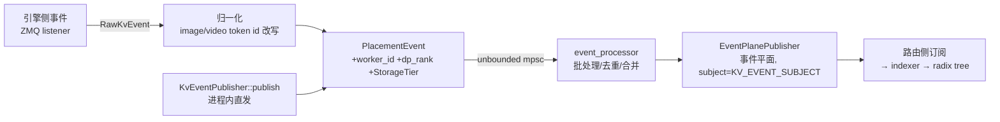

# 第 10 章 · KV 事件与发布订阅（源码深读版）

> **适合谁读**：所有读者（第三部分必读）。
> **前置**：ch07（事件平面）、ch09。
> **耗时**：55 分钟
> **源码锚点**：commit `61e9184`（v1.5.0）。本章引用的常量、字段、流程均核对过源码。

**学完能：**
- 拆解 `KvEventPublisher` 的五段内部管线，说出每段的存在理由
- 默写 KV 事件的线格式（`RawKvEvent`）主要字段，解释 LoRA/多模态/EAGLE/命名空间字段各自解决什么
- 区分 KV 事件与 worker 负载指标两条流（主题、结构、语义都不同）

---

## 10.1 管线总览

`lib/llm/src/kv_router/publisher/mod.rs` 的 `KvEventPublisher`（195 行起）
内部是一条五段管线：



逐段拆解：

**① 事件源（ZMQ，当前唯一支持的外部源）**。`KvEventSourceConfig::Zmq`
（`mod.rs:69`）带四个参数：endpoint、topic、`image_token_id`、`video_token_id`。
后两个是**多模态归一化**用的：vLLM 的 `BlockStored` 事件里的块哈希可能基于
引擎原生的图像/视频占位符 token 方案，监听器会把它们改写成 Dynamo 的规范
`pad_value` 方案，否则同一张图在引擎侧和路由侧会哈希出两个不同身份。
文本-only 部署传 `None`，归一化是空操作。

**② 事件包装（PlacementEvent）**。裸事件只说"哪些块存/删了"；
`PlacementEvent` 补上空间坐标：

```rust
PlacementEvent::new(
    Placement::local_worker(self.worker_id, event.dp_rank, storage_tier),  // Gpu / HostPinned / Disk
    event,                                                                // KvCacheEvent
)
```

`publish_with_storage_tier()`（`mod.rs:514`）说明：KVBM 下放（ch16）产生的
"块现在在 CPU"事件和引擎产生的"块在显存"事件走同一条管线，只是 tier 不同
——索引天然分层（ch11 的 `tier_overlap_blocks`）从这里就开始了。

**③ 通道与批处理**。`mpsc::unbounded_channel::<Vec<PlacementEvent>>()`——
发送永不阻塞 worker。下游 `event_processor` 做合并：
`DEFAULT_MAX_BATCH_BLOCKS = 128`（单批块数上限）、批超时默认 **None**、
上限强制 15 秒（`MAX_BATCHING_TIMEOUT_MS`，超了会告警并截断）。`dedup.rs`
再滤掉被同批后续事件覆盖的条目。

**④ 事件平面发布**。`EventPlanePublisher` 把批事件发到主题
`KV_EVENT_SUBJECT`（NATS 或 ZMQ，ch07 的可插拔事件平面）。

**⑤ 一个容易忽略的细节：事件源本身也走服务发现。** 发布器启动时向 etcd
注册 `DiscoverySpec::EventSource`，元数据里带 `kv_state_endpoint`、
`WorkerWithDpRank`、`publisher_id`、`recovery_target`（`mod.rs:416-440`）。
路由侧不是"盲目订阅一个话题"，而是**从 etcd 发现当前活着的事件源**再订阅
——worker 生死与事件源存亡保持一致（ch08 的 lease 语义延伸到了事件面）。

## 10.2 线格式：`RawKvEvent`

`lib/kv-router/src/zmq_wire/types.rs:88` 定义跨进程序列化格式（msgspec 风格，
`#[serde(tag = "type")]`）：

```rust
pub enum RawKvEvent {
    BlockStored {
        block_hashes: Vec<BlockHashValue>,       // 块哈希序列（signed/unsigned 归一到 u64）
        parent_block_hash: Option<BlockHashValue>, // 父块哈希（radix 树的边）
        token_ids: Vec<u32>,                     // 原始 token（用于重建/校验）
        block_size: usize,
        medium: Option<String>,                  // 存储介质
        lora_name: Option<String>,               // LoRA 适配器感知的块哈希
        cache_salt: Option<String>,              // 实际语义是 cache_namespace（见注释）
        block_mm_infos: Option<Vec<Option<BlockExtraInfo>>>, // 多模态对象在块内的偏移
        is_eagle: Option<bool>,                  // 投机解码（EAGLE）目标 KV
        group_idx: Option<u32>,                  // EAGLE 分组
        kv_cache_spec_kind: Option<KvCacheSpecKind>,        // 如滑动窗口注意力
        kv_cache_spec_sliding_window: Option<u32>,
        locality: Option<Locality>,
        ownership: Option<String>,               // framework / kvcr（KV cache retention）
    },
    BlockRemoved { block_hashes, medium, group_idx, ... },
    AllBlocksCleared { ownership },
    Ignored,
}
```

值得讲的三组字段：

- **`parent_block_hash` + `block_hashes`**：事件携带的是"从父块延伸出的块链"，
  正好是 radix 树一次插入需要的形状（ch11）。
- **`lora_name` / `cache_salt`**：块身份不是纯 token 哈希——换了 LoRA 适配器
  或换了缓存命名空间，同样 token 算出的哈希**必须不同**（KV 内容不同）。这
  是多租户隔离的第一道闸（第二道在 ch11 的 keyed tracking）。
- **`is_eagle` / `group_idx` / `kv_cache_spec_*`**：投机解码的 draft/target
  KV、滑动窗口注意力各有独立块空间，线格式原生支持。

进程内的规范形态则是 `protocols.rs:1229` 的 `KvCacheEventData`：

```rust
pub enum KvCacheEventData {
    Stored(KvCacheStoreData),   // { parent_hash, start_position: Option<u32>, blocks }
    Removed(KvCacheRemoveData),
    Cleared,                    // 清空该 (worker_id, dp_rank) 的全部 KV 记账
}
```

`start_position` 用于**位置敏感重放**（positional replay，配合 ch11 的
`positional.rs`——同一个块出现在序列不同位置，可复用性不同）。

## 10.3 生命周期与故障语义

- **单调事件序**：`next_event_id: Arc<AtomicU64>`（`mod.rs:209`）给每个事件
  编号；ZMQ 监听器与进程内直发共享计数器，消费侧可以检测缺口。
- **发布器生死耦合**（文档注释明说，`mod.rs:189-194`）：引擎侧发布器与
  Dynamo 侧 `publisher_id` 绑定，**不支持引擎单独重启而发布器存活**；将来
  要支持，必须先发一条按 rank 有序的 `Cleared` 或换新 publisher_id——否则
  新引擎实例的块身份与旧索引记账对不上。排障见到"引擎重启后命中率异常"，
  先想到这里。
- **恢复通道**：如果启用了 worker 本地索引（`LocalKvIndexer`），发布器还会
  起一个 `start_worker_kv_query_endpoint`（`mod.rs:384`）——路由可以**主动
  拉取**该 worker 的索引快照做恢复；起失败则广播"live-only KV source"（只
  有实时流、无法回溯），路由侧降级而非崩溃。
- **优雅退出**：`Drop for KvEventPublisher` 触发 `shutdown()`：取消令牌、
  中止监听、从 etcd 注销事件源。

## 10.4 另一条流：worker 负载指标

`publisher/worker_metrics.rs` 的 `WorkerMetricsPublisher` 与 KV 事件**平行且
独立**，别混为一谈：

| | KV 事件 | 负载指标 |
|---|---------|----------|
| 主题 | `KV_EVENT_SUBJECT` | `KV_METRICS_SUBJECT` |
| 结构 | `RawKvEvent`/`PlacementEvent`（块级） | `ActiveLoad { worker_id, dp_rank, active_decode_blocks, active_prefill_tokens, kv_used_blocks }` |
| 语义 | "我缓存/释放了哪些块"（状态增量） | "我现在多忙"（瞬时快照） |
| 节流 | 批处理 + 去重（128 块/批） | watch channel 去重 + **1ms 防抖**（`PUBLISH_DEBOUNCE`） |
| 消费者 | 索引（ch11） | 打分器（ch12 的负载项） |

注意 `ActiveLoad.active_prefill_tokens` 在 worker 侧发布时是 `None`——
prefill 侧的在途 token 数由**路由自己在 `add_request` 时记账**
（`router_track_prefill_tokens`，默认开）：因为只有路由知道请求何时被接受，
worker 永远滞后。这个"谁来记账"的选择是 ch13 序列跟踪的入口问题。

## 10.5 尽力而为语义（深版重述）

ch01 建立过"索引允许错、结果不允许错"的直觉，现在可以精确到机制：

| 丢失/乱序 | 检测/自愈机制 |
|-----------|---------------|
| 事件缺口 | `next_event_id` 单调性可检测；重放用 `start_position` |
| 引擎重启 | publisher_id 生死耦合 + `Cleared` 语义（10.3） |
| 索引"多记" | 路由到目标后未命中 → 引擎重算，正确性无损（ch11 深版展开） |
| 索引"少记" | 只是次优；predict-on-route 侧索引（ch11）用路由决策本身回补 |

## 小结

- 五段管线：ZMQ 源（MM 归一化）→ Placement 包装（tier）→ 无界通道 →
  批处理/去重 → 事件平面；事件源经 etcd 发现注册。
- 线格式字段即设计文档：parent 链、LoRA/命名空间盐、EAGLE 分组、位置重放。
- 两条流分清楚：KV 事件（状态增量，进索引）vs 负载指标（快照，进打分）。

## 自检（5 题，自答）

1. 多模态部署里 `image_token_id` 不传会发生什么？症状会表现为什么？
2. KVBM 把一块 KV 从显存下放到 CPU，事件流上发生了什么？（提示：
   `publish_with_storage_tier`）
3. 引擎进程单独重启（Dynamo 发布器对象还在），为什么索引会出问题？
   规范的修复路径是什么？
4. `ActiveLoad.active_prefill_tokens` 为什么不由 worker 上报？
5. 批处理上限 128 块 + 15 秒强制截断，各自防的是什么病？

## 下一步（跳转推荐）

- → [ch11 前缀索引：Radix Tree](ch11-prefix-index.md)（这些事件如何变成树）
- → [ch12 路由决策](ch12-routing-decision.md)（overlap 数字如何进入打分）
