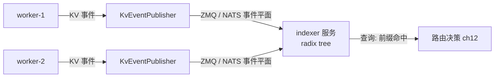

# 第 10 章 · KV 事件与发布订阅

> **适合谁读**：所有读者（第三部分必读）。
> **前置**：ch07（事件平面）、ch09。
> **耗时**：40 分钟
> **源码锚点**：commit `61e9184`（v1.5.0）。

**学完能：**
- 拆解一条 KV 事件的字段语义与从 worker 到索引的完整通路
- 解释批处理、去重、序列追踪这些"事件卫生"机制为什么存在
- 理解事件丢失后的自愈路径

---

## 10.1 KV 事件解决什么问题

路由器想知道："**每个 worker 上现在缓存了哪些 token 前缀？**" 让路由器去轮询
worker 既慢又侵入。Dynamo 的做法是反向信息流：



worker 在处理序列的过程中持续发布事件：开始了一个序列、缓存了第 N 块、
序列结束（块可复用/可驱逐）。路由器侧把这些事件灌进前缀索引（ch11），
于是"哪些前缀在哪些 worker"始终近似最新。

## 10.2 源码地标

```
lib/llm/src/kv_router/publisher/mod.rs        # KvEventPublisher（195 行，已核验）
lib/llm/src/kv_router/publisher/event_processor.rs
lib/llm/src/kv_router/publisher/batching.rs   # 事件批处理
lib/llm/src/kv_router/publisher/dedup.rs      # 去重
lib/llm/src/kv_router/publisher/zmq_listener.rs
lib/llm/src/kv_router/publisher/worker_metrics.rs  # 负载/指标流（ch12 输入）
lib/llm/src/kv_router/publisher/state_agent.rs
lib/kv-router/src/zmq_wire/                   # 线格式（worker↔indexer 契约）
lib/kv-router/src/services/indexer/server.rs  # 独立 indexer 服务
lib/kvbm-consolidator/                        # vLLM 侧事件 → 路由线格式 的桥
```

`KvEventPublisher` 在 LLM 侧（`lib/llm`）而不是纯 `lib/kv-router`，因为它要
贴近引擎事件源：不同后端（vLLM/SGLang）产生的事件形态不同，
`kvbm-consolidator`（`ingress/zmq_subscriber.rs` + `egress/zmq_publisher.rs`）
负责把 vLLM 侧事件**整合**成路由器统一线格式再发出去。

## 10.3 一条事件的生命周期

以 vLLM worker 处理一条 2000-token 请求（块大小 16）为例：

1. **引擎内部**：vLLM 分配/填充 KV block（它自己的 PagedAttention 记账）。
2. **桥接**：`kvbm-consolidator` 订阅引擎事件，转成 `zmq_wire` 格式
   （典型字段：worker id、块哈希/块序号范围、序列状态、时间戳）。
3. **发布**：`KvEventPublisher`（publisher/`mod.rs`）做两件卫生工作后发出：
   - `batching.rs`：攒小批，降低通路开销；
   - `dedup.rs`：去掉重复/被覆盖的事件（同一块先"存储"后"删除"，只发终态）。
4. **传输**：事件平面（ZMQ 或 NATS，ch07）。
5. **消费**：indexer 服务（`services/indexer/server.rs`）或进程内索引把事件
   应用到 radix tree（ch11）：插入前缀节点、更新命中计数、或标记可驱逐。

> **块的身份**：token 序列按块哈希标识（Blake3，见 `lib/kv-hashing/src/`
> 的 block/compute 模块）。相同 token 前缀在任意 worker 上得到相同块哈希——
> 这是"前缀跨 worker 可识别"的数学基础。

## 10.4 尽力而为与自愈

事件通路允许丢失（ch07 的设计选择）。丢失的后果与修复：

| 丢失内容 | 后果 | 自愈机制 |
|----------|------|----------|
| "我缓存了块 X" | 索引少记，路由错过一次命中（次优但正确） | 后续同前缀事件补上 |
| "序列结束/块释放" | 索引多记，路由把请求发给已无该 KV 的 worker | worker 侧未命中 → 按无前缀处理重算，索引修正 |
| 负载指标（worker_metrics） | 选择器短期用旧负载 | 指标周期性重发 |

核心原则：**索引只是路由的优化输入，不是正确性的守门员**。发错了 worker
代价是"多算一次 prefill"，而不是错误答案。这个性质让整个事件链路可以大胆
做批处理、去重、压缩（`concurrent_radix_tree_compressed` 等优化才有意义）。

## 10.5 worker 负载：另一条并行的"事件"

除了 KV 事件，`publisher/worker_metrics.rs` 还把每个 worker 的负载（在途序列数、
KV 占用、队列深度等）送到路由侧。**KV 命中回答"去哪最省"，负载回答"去哪不挤"**，
两者在 ch12 的选择器里合成最终决策。把这两条流分清，是读懂路由代码的前提。

## 小结

- 信息流反转：worker 主动发布"我有什么"，路由器维护全局索引。
- 通路 = 桥接（consolidator）→ 发布（batch/dedup）→ 事件平面 → indexer。
- 尽力而为语义：索引错误只造成次优，不造成错误结果；靠后续事件与未命中反馈自愈。

## 自检（4 题，自答）

1. 为什么不能让路由器轮询 worker 获取 KV 状态？发布订阅反转后得到了什么？
2. `batching.rs` 和 `dedup.rs` 各自解决什么问题？它们会不会让索引"更错"？
3. 事件丢了导致索引"多记"，最终怎么被发现和修正？代价是什么？
4. 块哈希为什么必须跨 worker 一致？由哪个 crate 保证？

## 下一步（跳转推荐）

- → [ch11 前缀索引：Radix Tree](ch11-prefix-index.md)（事件的消费方）
- → [ch12 路由决策](ch12-routing-decision.md)（索引的使用方）
