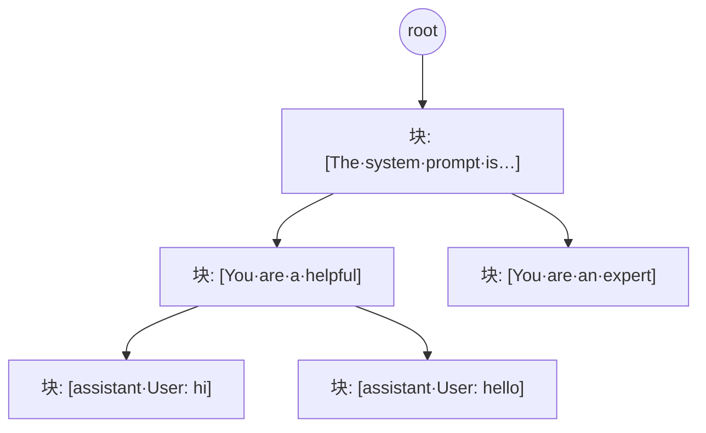

# 第 11 章 · 前缀索引：Radix Tree 与变体

> **适合谁读**：所有读者（第三部分核心章）。
> **前置**：ch10。
> **耗时**：50 分钟
> **源码锚点**：commit `61e9184`（v1.5.0）。

**学完能：**
- 手画一个 3 层 radix tree 并解释插入/查询/驱逐在 token 前缀场景的语义
- 说清 Dynamo 为什么有 5+ 种 indexer 变体，各自适用场景
- 把"前缀命中率"与 TTFT/吞吐收益建立起量化直觉

---

## 11.1 为什么是 radix tree

需求：对任意请求的 token 序列，快速回答"**哪些 worker 缓存了它的最长前缀，
命中多少块**"。

- 用完整 token 串做 key 的哈希表：只支持全串命中，长 prompt 下几乎永不命中。
- 按块（如 16 token/块）切分后建 **radix tree**（压缩前缀树）：路径按块组织，
  任意祖先节点都是一个"已缓存前缀"——系统提示词、多轮对话、共享 few-shot
  前缀天然复用。



节点属性（概念上）：块哈希、哪个 worker 持有、引用计数/最后命中时间。
请求 token 序列 → 沿树下行到最深处 → 沿途节点即命中前缀 → 候选 worker 集合。

## 11.2 源码地标与家族图谱

```
lib/kv-router/src/indexer/
├── radix_tree.rs                        # 经典实现（入门必读）
├── concurrent_radix_tree.rs             # 无锁并发版
├── concurrent_radix_tree_compressed/    # 压缩版（node/store/matches/repair）
├── cuckoo/                              # cuckoo filter：分布式/DC 场景
├── approximate_lru.rs                   # 近似 LRU 驱逐启发
├── pruning.rs / positional.rs           # 修剪 / 位置感知
├── branch_sharded.rs / lower_tier.rs    # 分片 / 下层（offload）索引
├── kv_indexer.rs                        # 顶层组合
├── traits.rs / types.rs                 # 抽象与类型
lib/tokens/src/radix.rs                  # token 级 radix 工具
```

为什么这么多变体？各自的针对性：

| 变体 | 解决的问题 |
|------|-----------|
| `concurrent_radix_tree` | 事件流写入与路由查询并发，锁竞争成为瓶颈 |
| `concurrent_radix_tree_compressed` | 大集群下树本身的内存占用（含 repair：并发结构的一致性修复，呼应 ch10 的"索引允许短暂不准"） |
| `cuckoo/` | 跨数据中心/多池场景只问"有没有"，不要精确集合——空间换精度 |
| `approximate_lru` | 精确 LRU 代价高，近似即可（驱逐本来就可以次优） |
| `lower_tier` | KV 被下放到 CPU/SSD 后，索引要区分"在 GPU"还是"在下层"（对接 ch16） |
| `positional.rs` | 前缀匹配的位置敏感性（同一块出现在不同位置可复用性不同） |

> 阅读策略：先读 `radix_tree.rs` 吃透语义，再跳 `traits.rs` 看接口抽象，
> 变体按需取用。不要按目录顺序通读。

## 11.3 三个核心操作

### 插入（事件：worker-w 缓存了块序列 b1..bn）

沿树走/建路径到 bn，沿途每个节点登记"worker-w 持有"。块由 Blake3 哈希标识
（`lib/kv-hashing/src/block.rs`），相同内容自然合并。

### 查询（路由：请求 token 序列 t1..tm）

切成块序列，沿树下行到第一个不存在的块为止；收集沿途节点上的 worker 集合与
命中深度。"命中 85%" = 匹配块数 / 请求总块数。

### 驱逐（事件：worker-w 释放了块 / 容量压力）

从节点上摘掉 worker-w 的记录；节点无人持有则可修剪（`pruning.rs`）。
驱逐策略在 worker 侧与索引侧各有一份视角：worker 侧决定"实际扔哪块"
（ch13 的调度/驱逐策略 + ch16 KVBM），索引侧只是被动记账。

## 11.4 命中率 → 收益的量化直觉

设请求共 P 个 prefill token，命中 C 个：

- 省下的计算量 ≈ C/P 的 prefill FLOPs；TTFT 相应下降。
- 但命中部分仍需 **KV 传输**（若走 PD 分离）或**直接复用**（同 worker）：
  传输 1 token KV 的字节 ≪ 计算 1 token 的开销，所以命中几乎总是赚的，
  直到 KV 带宽本身成为瓶颈（ch15 的 Roofline 讨论）。
- 多轮对话/固定系统提示词的负载，稳态命中率可达 70–90%+；一次性随机 prompt
  则趋近 0——**索引的价值完全由负载的前缀重复度决定**，评估时先看 trace
  （`lib/data-gen/` 有合成负载模型）。

## 11.5 动手：观察一棵真实的树

用 ch05 的 mocker 环境 + `--router-mode kv`：

1. 同一系统提示词发 3 次请求，观察 frontend 日志里第二、三次的命中信息变化。
2. 换不同提示词前缀，看候选 worker 集合如何变化。
3. 杀掉一个 worker（ch08 的 lease 过期），观察该 worker 从索引中消失后路由的
   回退行为（换下一个候选）。

## 小结

- radix tree 是"前缀可复用"这一负载特征的数据结构化；块哈希是跨 worker 的
  身份系统。
- 家族变体都在为"并发、内存、精度"做不同取舍，语义原型在 `radix_tree.rs`。
- 索引回答命中，负载回答拥挤，二者在下一章合流。

## 自检（5 题，自答）

1. 为什么不用哈希表 keyed by 完整 prompt？为什么按 16-token 块而不是单 token？
2. `concurrent_radix_tree_compressed` 里的 repair 对应 ch10 的哪条设计原则？
3. 索引侧的"驱逐"和 worker 侧的驱逐是什么关系？谁是因谁是果？
4. `lower_tier` 索引为什么要区分 KV 在 GPU 还是在 CPU/SSD？
5. 负载完全随机（无共享前缀）时，KV 感知路由退化成什么？还有副作用吗？

## 下一步（跳转推荐）

- → [ch12 路由决策与 Worker 选择](ch12-routing-decision.md)
- → [ch16 KVBM](../04-disagg/ch16-kvbm.md)（`lower_tier` 的另一半故事）
