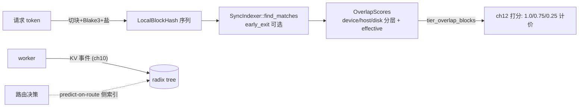

# 第 11 章 · 前缀索引：Radix Tree 与变体（源码深读版）

> **适合谁读**：所有读者（第三部分核心章）。
> **前置**：ch10。
> **耗时**：60 分钟
> **源码锚点**：commit `61e9184`（v1.5.0）。

**学完能：**
- 读懂 `SyncIndexer` trait 的接口契约（`find_matches` 返回什么、anchor 是什么）
- 解释块哈希身份系统（Blake3、LoRA 盐、命名空间盐、keyed tracking）
- 说清 `KvIndexer` 的 actor 化结构、并发树、predict-on-route 侧索引与
  远端索引服务四种部署形态

---

## 11.1 接口契约：`SyncIndexer`

`lib/kv-router/src/indexer/traits.rs` 定义索引的核心抽象（209 行起）：

```rust
pub trait SyncIndexer: Send + Sync + 'static {
    fn find_matches(&self, sequence: &[LocalBlockHash], early_exit: bool)
        -> OverlapScores;
    fn find_matches_from_anchor(...);   // 见 11.5 locality
    // ...
}
pub trait AnchorCapableSyncIndexer: SyncIndexer {}   // 能力标记 trait
```

两个设计点：

- **输入是块哈希序列，不是 token 序列**。路由拿着 token 先切块、算哈希
  （11.2），索引只见哈希——索引完全不关心词表和分词，天然与引擎解耦。
- **`early_exit`**：调用方（打分器）可以宣告"我只要知道命中是否超过某阈值，
  不需要精确值"，索引可以提前剪枝——路由路径的毫秒预算意识渗透到了接口。

`OverlapScores` 的形状（从 ch12 的消费侧反推）：每个候选 worker 一组
分层命中——`device / host_pinned / disk` 三层块数（对应 ch12 打分公式里的
三档权重 1.0 / 0.75 / 0.25），以及加权合成后的 `effective_overlap_blocks`。
另有 `SharedKvCache` 与 `TieredMatchProvider` 两个 trait 分别抽象共享缓存
（hicache）查询与分层匹配供给。

## 11.2 块的身份系统

一个块 = `Blake3(token 块, parent_hash, 盐)` 的链接哈希（`lib/kv-hashing/`：
`block.rs`/`compute.rs`/`salt.rs`/`request.rs`）。三层"盐"决定隔离强度：

| 盐 | 字段 | 效果 |
|----|------|------|
| LoRA 适配器名 | 线格式 `lora_name` | 同 token + 不同 LoRA = 不同块（KV 数值不同） |
| 缓存命名空间 | 线格式 `cache_salt`（语义是 `cache_namespace`） | 租户/业务级隔离 |
| **keyed tracking** | `DYN_ROUTER_TRACKING_KEY_FILE` / `_KEY_ID`（`TrackingHashAlgorithm`） | 带密钥的哈希：没有密钥的一方**无法**为任意 token 序列构造合法块哈希 |

keyed tracking 是个容易被忽视的安全细节：块哈希本是确定性的——任何人都能
算出"系统提示词 X 的块哈希"，然后通过观察路由行为做**前缀探测侧信道**
（"这个租户是不是在用这段提示词？"）。带密钥的跟踪哈希把"能构造哈希"的
能力限制在持有密钥的路由域内。

链接哈希（含 parent）还有一个好处：**树上的路径就是身份的一部分**——两个
不同前缀分叉后的相同块内容得到不同哈希，天然防"同内容不同位置误合并"；
位置敏感性由 `positional.rs` 在匹配侧另行处理（配合 ch10 的
`start_position` 重放）。

## 11.3 `RadixTree`：本体

`lib/kv-router/src/indexer/radix_tree.rs`（1048 行）。关键 API：

```rust
pub struct RadixTree { ... }

impl RadixTree {
    pub fn find_matches(&self, sequence: Vec<LocalBlockHash>,
                        early_exit: bool) -> OverlapScores;        // :225
    pub fn apply_event(&mut self, event: RouterEvent)
        -> Result<(), KvCacheEventError>;                          // :229
    pub fn remove_worker(&mut self, worker_id: WorkerId);          // :665
    pub fn remove_worker_dp_rank(&mut self, worker_id, dp_rank);   // :669
    pub fn clear_all_blocks(&mut self, worker_id: WorkerId);       // :685
    pub fn dump_tree_as_events(&self) -> Vec<RouterEvent>;         // :700
    pub fn current_size(&self) -> usize;                           // :783
}
```

对照 ch10 的事件流：

- `apply_event(RouterEvent)` 消费 ch10 的 `Stored/Removed/Cleared`——
  **插入是事件驱动的**，事件里的 `parent_block_hash → block_hashes` 链正好
  沿树下行建边。
- `remove_worker*` 由 ch08 的发现层删除事件触发：worker 消失，树上该 worker
  的持有记录即时摘除（节点可能保留给其他 worker）。
- `dump_tree_as_events()` 把整棵树**反向导出为事件序列**——这就是快照/恢复
  的通用机制：任何索引状态 = 初始空树 + 事件重放。10.3 的 worker 恢复端点、
  ch13 的 `dump_events` 都建立在这个性质上。

内存有 `current_size()` 上限控制，超限走 `approximate_lru.rs`（近似 LRU 的
簿记是采样/计数式的，不是全局精确序——规模下精确 LRU 的链表维护本身就
是热点）。

## 11.4 `KvIndexer`：actor 化的组合器

`lib/kv-router/src/indexer/kv_indexer.rs`（1001 行，`KvIndexer` 在 297 行）
不是另一棵树，而是把树的读写封装成**消息驱动 actor**：

```text
KvIndexer
├── event_sender()            → 事件入站（apply_event）
├── snapshot_event_sender()   → DumpRequest（导出快照）
├── remove_worker_sender()    → 摘除 worker
├── get_workers_sender()      → 查询持有集合
└── new_with_pruning() / new_with_approximate_retention(...)   // 修剪/近似保留策略
```

为什么 actor 化？看 `KvRouterConfig.router_event_threads`（默认 **4**）的
文档注释：*"When > 1, uses ConcurrentRadixTree with a thread pool for
event-driven and approximate routing writes"*——事件写入是吞吐热点，多线程
写 + 无锁并发读。`concurrent_radix_tree.rs` 提供并发版本，
`concurrent_radix_tree_compressed/`（node/store/matches/repair）进一步压缩
节点表示；`repair.rs` 的存在呼应 ch10 的"尽力而为"：并发结构的短暂不一致
靠修复例程收敛，而不是全局锁。

## 11.5 四种部署/加速形态

变体不少，按"解决什么工程问题"重排：

1. **并发 + 压缩**（上面已讲）：写吞吐与内存。
2. **`positional.rs`**：位置敏感匹配——同一块哈希在序列不同位置命中，价值
   不同（注意力因果性决定只有"从 0 开始连续"的前缀可复用）。
3. **`lower_tier.rs`**：分层记账——ch10 的 `StorageTier` 事件让同一棵树区分
   "在显存 / 在 CPU / 在磁盘"，供 ch12 分层计价。
4. **`branch_sharded.rs`**：按分叉分片，多索引实例分担热点前缀。
5. **`cuckoo/`**：布谷过滤器——只回答"大概有没有"，空间远小于精确树；
   跨 DC / 多池场景（ch15 的 cuckoo 消费者）用它做粗筛。
6. **`use_remote_indexer` / `serve_indexer`**（配置项，`DYN_USE_REMOTE_INDEXER`）：
   索引作为**独立服务**部署（`lib/kv-router/src/services/indexer/server.rs`），
   路由进程查询远端索引而不是本地养树——路由副本很多时，一份索引比 N 份
   副本省内存且无同步问题；代价是查询 RTT 进路由延迟。
7. **predict-on-route 侧索引**（`router_predicted_ttl_secs`）：最有意思的
   一个。开启后路由**把每次路由决策本身当作一次"预测写入"**——"我把这段
   前缀发给 worker-3，那 worker-3 大概率马上就会有这些块"。文档注释明说：
   `find_matches` 会同时查事件驱动主索引和这个本地侧索引，**返回 per-worker
   最大值**。它补偿的正是 ch10 说过的"事件永远滞后"：刚路由出去的请求，
   其 KV 事件还没到，但侧索引已经"预记"了。TTL 到期未获真实事件确认则过期。

## 11.6 从查询到打分的桥

把三件事串起来（ch10 → 本章 → ch12）：



`effective_overlap_blocks`（f64）的存在理由：分层加权、共享缓存折算
（`shared_beyond_device_blocks` × multiplier）之后，"有效命中"不再是整数块
——这就是 ch12 里 `overlap_blocks: u32` 与
`effective_overlap_blocks: f64` 并存的原因。

## 11.7 动手实验（升级版）

1. **观察滞后与预测补偿**：mocker 环境 `--router-mode kv`，高并发发同前缀
   请求，对比 `DYN_ROUTER_PREDICTED_TTL_SECS=30` 前后的命中率变化。
2. **看测试学边界**：`lib/kv-router/src/indexer/tests.rs` 覆盖了事件应用、
   worker 摘除、修剪等行为；ch12 引用的 selector 单测则钉死了打分边界
   （如同分随机、taints 过滤）。
3. **键控哈希**：设置 `DYN_ROUTER_TRACKING_KEY_FILE` 后重启，观察旧索引
   快照为何全部失效（哈希域变了）——体验"身份系统换钥匙 = 全部 miss"。

## 小结

- 契约：`find_matches(&[块哈希], early_exit) -> 分层 OverlapScores`；
  身份 = Blake3 链接哈希 + LoRA/命名空间/密钥三重盐。
- `RadixTree` 事件驱动、可导出重放（快照=事件序列）；`KvIndexer` actor 化
  并发（默认 4 写线程）。
- 四种形态各答一题：并发答吞吐、远端索引答副本内存、cuckoo 答跨域粗筛、
  predict-on-route 答事件滞后。

## 自检（6 题，自答）

1. 为什么索引的输入接口用块哈希而不是 token？（至少两条理由）
2. keyed tracking 防的是什么攻击？没有多租户的部署还需要吗？
3. `dump_tree_as_events` 为什么足以充当快照机制？恢复时要注意什么
  （提示：事件序）。
4. predict-on-route 侧索引如果 TTL 过长，会造成什么错误？谁纠正它？
5. `early_exit=true` 时打分器拿到的 overlap 可能不精确，这对 ch12 的公式
   是问题吗？为什么可以接受？
6. 远端索引服务用一份共享索引换掉了什么？引入了什么新风险？

## 下一步（跳转推荐）

- → [ch12 路由决策与 Worker 选择](ch12-routing-decision.md)
- → [ch16 KVBM](../04-disagg/ch16-kvbm.md)（分层事件的制造端）
