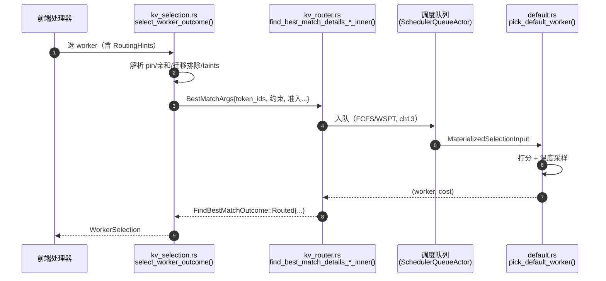

# 第 12 章 · 路由决策与 Worker 选择（源码深读版）

> **适合谁读**：所有读者（源码主线的路由章）。建议开着编辑器跟读。
> **前置**：ch08、ch10、ch11。
> **耗时**：70 分钟
> **源码锚点**：commit `61e9184`（v1.5.0）。本章引用的公式、字段、默认值均逐行核对过源码。

**学完能：**
- 默写 Dynamo 内置选择器的打分公式，解释每一项的物理含义与默认值
- 走通 `select_worker_outcome` → `find_best_match` → 打分采样 的完整调用链
- 用 `DYN_ROUTER_*` 环境变量/`--router-mode` 旗标调出想要的路由行为，并用结构化日志验证

---

## 12.0 本章地图

决策代码分两层（回顾 ch03 的分工）：

| 层 | 文件 | 职责 |
|----|------|------|
| 接入层（lib/llm） | `lib/llm/src/kv_router/routing_host/kv_selection.rs` | 拿到请求的全部路由输入，解析 pin/亲和/约束，调用核心 |
| 核心层（lib/llm + lib/kv-router） | `lib/llm/src/kv_router.rs`（3468 行）、`lib/kv-router/src/scheduling/selector/default.rs`（1951 行） | 准入、重叠计算、打分、采样 |

一个历史注脚：`default.rs:91` 的注释写着 *"Default implementation matching the
Python `_cost_function`"*——今天这个 Rust 选择器是从 Dynamo 早期 Python 路由
的代价函数移植来的，公式语义一脉相承。

## 12.1 决策的全部输入

`kv_selection.rs` 的 `select_worker_outcome()`（`routing_host/kv_selection.rs:184`）
从 `PreprocessedRequest` 收集路由输入，比"命中 + 负载"这个入门印象丰富得多：

| 输入 | 来源字段 | 作用 |
|------|----------|------|
| token 序列 + 多模态块信息 | `block_mm_routing_info()` | 索引查询的 key |
| 阶段 pin | `RoutingHints::{prefill,decode}_worker_id`、`backend_instance_id`、`dp_rank` | 分离模式下"这条请求第 N 段必须去谁"（ch14） |
| 会话亲和 | `AffinityTarget`（`--router-session-affinity-ttl-secs` 开启） | 同会话粘住同 worker/rank |
| 迁移排除 | `migration_state.excluded_worker_ids()` | 已尝试失败的 worker 不再入选 |
| 允许集合 | `allowed_worker_ids: HashSet<WorkerId>` | 白名单硬过滤 |
| 路由约束 | `RoutingConstraints`（taints 相容性检查） | K8s 式污点/亲和标签 |
| 请求级覆盖 | `RouterConfigOverride` | 单请求改权重/温度 |
| 优先级 | `priority_jump: f64`、`strict_priority: u32` | 队列加塞（ch13） |
| LoRA / 缓存命名空间 | `lora_name`、`cache_namespace` | 块哈希隔离（ch10/ch11） |

> **taints 小知识**：worker 注册时可携带污点标签，请求约束可以要求
> （required）/偏好（preferred，乘性系数）/回避（negative preferred）特定标签
> ——`default.rs` 里有成组的单测（`test_required_taints_*`、
> `test_negative_preferred_taints_avoid_matching_worker`）。这是把 K8s 的
> 污点/容忍语义搬进了路由层，用于异构池（如"这条请求只能去支持某量化的
> worker"）。

## 12.2 调用链走读



返回值不是"一个 worker id"那么简单——`kv_router.rs:346` 定义：

```rust
pub enum FindBestMatchOutcome {
    Routed {
        worker: WorkerWithDpRank,
        overlap_blocks: u32,              // 命中的块数（取整）
        effective_overlap_blocks: f64,    // 加权后的"有效"命中（见 12.3）
        cached_tokens: usize,             // 等价 token 数
        potential_decode_blocks: u64,     // 该 worker 未来可为 decode 贡献的块
        routing_hashes: Option<RoutingDecisionHashes>, // 决策回放/审计用
        kv_hint: Option<KvHint>,          // 随请求带给 worker 的 KV 提示
    },
    QueueRejected { rejection: scheduling::QueueRejection },  // 全员过载 → 排队/拒绝
}
```

两个值得注意的设计：

- **`WorkerWithDpRank`**：worker ≠ GPU。一个 vLLM 进程（worker）内部可能有多路
  数据并行（dp_rank），路由精确到 rank。
- **`routing_hashes`**：把"当时看到哪些块哈希"记下来，供离线回放与对账
  （`tests/utils/router_logs.py` 会解析配套日志）。

## 12.3 核心：打分公式（逐项拆解）

以下整理自 `default.rs:271-386` 的 `worker_logit()`（可对照原文读）。

**第一步：算这个 worker 的"缓存抵扣"（overlap credit）。**

```
overlap_credit_blocks =
      overlap_score_credit × decay × device_overlap_blocks     ← 本机显存命中
    + host_cache_hit_weight × host_overlap_blocks              ← CPU 命中（默认权重 0.75）
    + disk_cache_hit_weight × disk_overlap_blocks              ← 磁盘命中（默认权重 0.25）
    + shared_cache_multiplier × shared_beyond_device_blocks    ← 共享缓存命中（默认 0.0）
```

- 不同层的命中价值不同：显存命中 = 1.0，CPU = 0.75，磁盘 = 0.25——**正好对应
  取回延迟的阶梯**（ch16 的分层在打分里就有价格标签）。
- `decay` 是"热点保护"：

```
normalized_prefill_load = (active_prefill_tokens − min_active_prefill_tokens)
                          / block_size / request_blocks
decay = 1 / (1 + overlap_score_credit_decay × normalized_prefill_load)   // 默认 decay 系数 = 0.0（关闭）
```

  相对最闲 worker 的超额 prefill 积压越多，缓存抵扣越缩水——防止所有请求
  涌向"缓存最热但也最忙"的 worker。源码注释原话：*"The rational decay softly
  trades cache locality for prefill balance"*。

**第二步：算"净代价" logit（prefill/聚合路径）：**

```
logit = prefill_load_scale × max(0, raw_prefill_blocks − overlap_credit_blocks)
      + decode_cost_blocks
      + decode_active_request_weight × active_requests
```

- 这是**减分制**：logit 越小越好（代价）。缓存命中从 prefill 负载里抵扣，
  `max(0,·)` 保证不为负。
- `decode_active_request_weight`（默认 0.0）：给每个在途请求记一笔块等价
  成本，用于"每请求 decode 计算量比 KV 占地更重要"的场景。

**decode 池特例**（`default.rs:317-340`）：

```
logit = max(0, decode_cost_blocks − overlap_credit_blocks) + active_request_cost_blocks
```

decode 路由通常通过请求级覆盖把 `overlap_score_credit` 置 0（纯负载路由）；
但当条件分离（ch14）保留了正向缓存抵扣时，这个分支让"缓存热"的 decode
worker 优先，同时仍然计入 decode 积压。`max(0,·)` 的原因写在注释里：
下游 taints 乘子假设非负分，负分会翻转污点偏好。

**第三步：污点乘子与选择**（`worker_cost()` + `pick_default_worker()`）：

```
cost = logit × preferred_taint_multiplier     // 无偏好时乘子缺省
```

然后按 `router_temperature`（默认 **0.0**）选择：

- **T = 0**：严格取最小 cost，**平手时做蓄水池抽样随机打破**（不是按 id 取
  第一个——避免同分永远偏向同一 worker）。
- **T > 0**：softmax 采样，cost 越低概率越高，温度越高越随机。实现是数值
  稳定版（先归一化量级再取指数，`softmax_sample_index`，`default.rs:40`）。
  动机：给路由加探索，避免负载信息的滞后性造成羊群效应。

```rust
// default.rs:486（T=0 路径，节选）
if cost < best_cost { best_worker = Some(worker); best_cost = cost; tie_count = 1; }
else if cost == best_cost {
    tie_count += 1;
    if fastrand::usize(0..tie_count) == 0 { best_worker = Some(worker); }
}
```

> **被 pin 的请求**（分离接力/亲和）跳过打分排序，直接返回 pin 目标，但
> 仍会过 `RoutingEligibility::validate_worker_rank`（存在性 + 约束检查）；
> 注意亲和 pin 的校验**故意忽略瞬时过载**（见 `kv_selection.rs` 测试
> `affinity_validation_ignores_transient_overload`）——粘性优先于一时的忙闲。

## 12.4 全部旋钮（`KvRouterConfig`，`scheduling/config.rs:748`）

| 旋钮 | 默认 | 环境变量 | 含义 |
|------|------|----------|------|
| `overlap_score_credit` | 1.0 | `DYN_ROUTER_KV_OVERLAP_SCORE_CREDIT` | 显存命中抵扣倍率；0=关前缀感知，>1 给命中额外加分 |
| `overlap_score_credit_decay` | 0.0 | `DYN_ROUTER_KV_OVERLAP_SCORE_CREDIT_DECAY` | 热点衰减系数；0=关 |
| `prefill_load_scale` | 1.0 | `DYN_ROUTER_PREFILL_LOAD_SCALE` | prefill 项整体缩放 |
| `decode_active_request_weight` | 0.0 | `DYN_ROUTER_DECODE_ACTIVE_REQUEST_WEIGHT` | 每在途请求的块等价成本 |
| `host_cache_hit_weight` | 0.75 | `DYN_ROUTER_HOST_CACHE_HIT_WEIGHT` | CPU 层命中权重 |
| `disk_cache_hit_weight` | 0.25 | `DYN_ROUTER_DISK_CACHE_HIT_WEIGHT` | 磁盘层命中权重 |
| `shared_cache_multiplier` | 0.0 | `DYN_SHARED_CACHE_MULTIPLIER` | 共享缓存命中权重；CLI 开共享缓存时设 0.5 |
| `shared_cache_type` | none | `DYN_SHARED_CACHE_TYPE` | `none` / `hicache`（SGLang L3） |
| `router_temperature` | 0.0 | `DYN_ROUTER_TEMPERATURE` | softmax 采样温度 |
| `router_queue_policy` | fcfs | `DYN_ROUTER_QUEUE_POLICY` | 队列策略（ch13） |
| `router_queue_threshold` | None | `DYN_ROUTER_QUEUE_THRESHOLD` | 全员超过 max_num_batched_tokens 此比例时排队 |
| `use_remote_indexer` / `serve_indexer` | false | `DYN_USE_REMOTE_INDEXER` | 索引外置为独立服务 |
| `router_predicted_ttl_secs` | None | `DYN_ROUTER_PREDICTED_TTL_SECS` | 开"路由即预测"侧索引（ch11） |

（完整清单见 `config.rs` 的 `Default for KvRouterConfig`，`DYN_ROUTER_*`
环境变量名集中在 `config.rs:1596-1668` 一带解析。）

**请求级覆盖**：`RouterConfigOverride` 允许单请求改写 overlap/scale/multiplier/
temperature——条件分离正是用它把 decode 路径的 `overlap_score_credit` 清零。

## 12.5 路由模式全集

`--router-mode` / `DYN_ROUTER_MODE`（定义在
`components/src/dynamo/common/configuration/groups/router_args.py:225`）：

| 模式 | 行为 | 备注 |
|------|------|------|
| `round-robin` | 轮询（**默认**） | 压测基线 |
| `random` | 随机 | |
| `power-of-two` | 随机取 2 个，选在途请求少的 | 经典 P2C；分离模式回落同步 prefill 路径 |
| `least-loaded` | 选在途请求最少的 | |
| `device-aware-weighted` | 按 CPU/CUDA 设备类型加权 | 异构池 |
| `direct` | 直连指定后端 | 绕过路由 |
| `kv` | 本章全流程（索引 + 负载 + 打分） | `--router-prefill-load-model=aic`、`--serve-indexer`、`--router-conditional-disagg` 都要求 kv 模式（`frontend_args.py:151/179/214` 有显式校验） |

排障时的**模式降档法**（kv → least-loaded → round-robin，逐级剥离输入）：

## 12.6 可插拔选择策略

内置选择器只是默认实现。`lib/kv-router/src/scheduling/worker_selection_config.rs`
定义了 YAML 化的策略实例：按 `aggregated / prefill / decode / encode` 四个池
各自指定具名实例，实例声明 `type`（由链接进来的策略 crate 注册，见
`lib/router-plugins/catalog` 与 `examples/router/custom-policy-example/`）和
任意 YAML 参数。校验规则本身就有教学意义：实例名 `default` 被保留给内置
选择器；引用不存在的实例、重复实例名都会启动失败——**fail-fast，不静默回退**。

## 12.7 观测与验证

三层由粗到细：

1. **结构化决策日志**（`kv_selection.rs:326`）：
   `[ROUTING] Best: worker_{id} dp_rank={rank} with {hit}/{total} blocks overlap`，
   带 `request_id` 字段；`tests/utils/router_logs.py` 靠它做断言，你也可以。
2. **公式分解日志**（`worker_logit`，DEBUG 级）：把每个候选 worker 的
   `logit = prefill_load_scale × adjusted_prefill_blocks + decode_blocks +
   active_request_cost_blocks` 各分项打出来，并注明
   `raw_prefill_blocks / overlap_credit_blocks / overlap_credit_decay`——
   调权重时直接看这里对账。
3. **NVTX range**：`route.select_worker`、`route.kv_match` 两个范围可用于
   nsys 火焰图定位路由耗时。

动手：mocker 双 worker，`DYN_LOG=dynamo=debug` 发一条固定前缀请求两次，
第二次在日志里找 `blocks overlap` 的变化；再把
`DYN_ROUTER_TEMPERATURE=0.8` 设上，观察选择分布的抖动。

## 小结

- 调用链：`select_worker_outcome`（输入收集/硬过滤）→ 队列（ch13）→
  `pick_default_worker`（打分/采样）。
- 公式：`logit = scale·max(0, prefill负载 − 缓存抵扣) + decode负载 + 请求成本`，
  缓存抵扣按层计价（1.0/0.75/0.25），可选热点衰减与共享缓存项。
- 选择 = 最小代价 + 温度采样；pin 跳过排序但过资格校验。
- 旋钮、模式、自定义策略、三层观测全部有源码坐标。

## 自检（6 题，自答）

1. `overlap_score_credit=0` 与 `--router-mode=least-loaded` 的行为差异是什么？
   还有哪些配置能到达类似效果？
2. 为什么 CPU 命中权重是 0.75 而磁盘是 0.25？如果你把 KV 下放到远端对象
   存储，这个阶梯该怎么延伸？
3. `decay` 公式中为什么要减去 `min_active_prefill_tokens`（全体候选的最小值）
   而不是绝对负载？
4. T=0 时两个 worker 严格同分，最终选谁？为什么这样设计？
5. decode 分支为什么 `max(0, decode − credit)` 而不是允许负值？注释里的
   理由是什么？
6. 给请求打了亲和 pin，但该 worker 此刻过载，会发生什么？对应的单测叫什么？

## 下一步（跳转推荐）

- → [ch13 调度、驱逐与序列跟踪](ch13-scheduling-eviction.md)（Routed 之前的
  队列故事）
- → [ch11 前缀索引](ch11-prefix-index.md)（overlap 数字是怎么算出来的）
