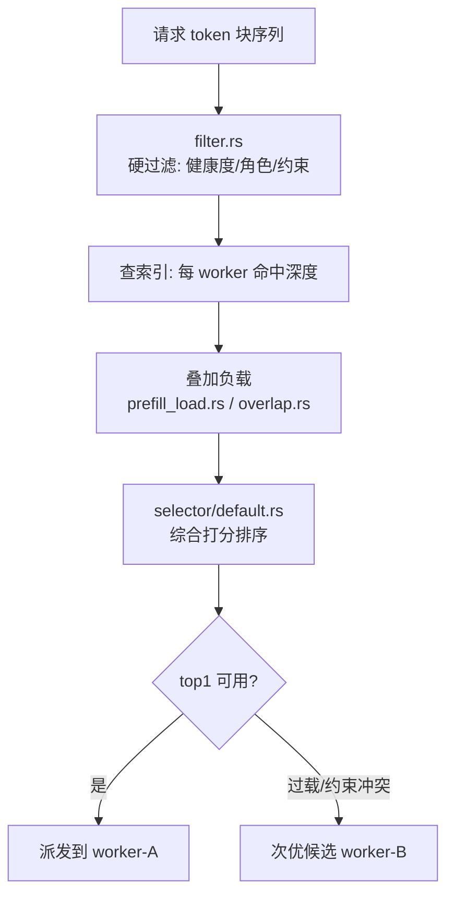

# 第 12 章 · 路由决策与 Worker 选择

> **适合谁读**：所有读者（源码主线的路由章）。
> **前置**：ch08、ch10、ch11。
> **耗时**：45 分钟
> **源码锚点**：commit `61e9184`（v1.5.0）。

**学完能：**
- 讲清 `KvRouter` → `RoutingHost` → 选择策略 的调用层次
- 解释一次决策如何综合前缀命中、负载、约束（亲和/角色/容量）
- 按需切换 `--router-mode` 并知道每种模式删掉了哪些输入

---

## 12.1 决策的输入与输出

输入（一个请求到达时路由器知道的全部）：

| 输入 | 来源 | 章 |
|------|------|----|
| token 序列（分块） | 前端分词 | ch09 |
| 前缀命中：候选 worker × 命中深度 | radix 索引 | ch11 |
| worker 负载（在途/队列/KV 占用） | `worker_metrics.rs` 指标流 | ch10 |
| 可用 worker 集合与角色 | 发现层 `WorkerSet` | ch08 |
| 路由约束（`RoutingConstraints`） | 请求/部署配置 | `lib/kv-router/src/protocols.rs` |

输出：**一个目标 worker**（或分离模式下的接力计划，见 ch14）。

## 12.2 源码层次

```
lib/llm/src/kv_router.rs                    # KvRouter 门面（532 行，已核验）
lib/llm/src/kv_router/routing_host.rs      # RoutingHost：宿主，串起各服务
lib/llm/src/kv_router/routing_host/kv.rs   # KV 感知选择逻辑
lib/llm/src/kv_router/routing_host/kv_selection.rs
lib/kv-router/src/scheduling/selector/default.rs   # 内置选择器打分
lib/kv-router/src/scheduling/selector/policy.rs    # 选择策略接口
lib/kv-router/src/scheduling/worker_selection_config.rs
lib/kv-router/src/services/selection/{service,server}.rs  # 独立选择服务
lib/kv-router/src/scheduling/{filter.rs,overlap.rs,prefill_load.rs}
```

`KvRouter`（LLM 侧）是门面：接 frontend 的请求问询，转给 `RoutingHost`。
`RoutingHost` 组织 indexer、负载订阅、调度器、选择器成一条决策管线。
真正的"打分排序"在 `lib/kv-router/src/scheduling/selector/`。

> 两侧分工：`lib/llm` 负责"把决策接入请求路径"（知道 frontend、知道引擎
> 事件），`lib/kv-router` 负责"决策本身"（纯逻辑，可独立测试、也可作为独立
> 服务部署——`components/src/dynamo/router/` 就是后者）。

## 12.3 一次决策的流水线



内置选择器的打分直觉（具体权重以源码为准）：

```
score(worker) ≈ α·前缀命中深度 − β·负载水位 − γ·队列惩罚 (+ 约束调整)
```

- 命中深度的价值是省掉的 prefill 计算；
- 负载项防止"赢家通吃"（都涌向缓存最多的热点 worker）；
- `overlap.rs` / `prefill_load.rs` 处理分离模式下 prefill 池的特殊负载形态
  （ch14 展开）；
- 过载保护（request-path 的 overload hints 在 router 层有界化，见仓库近期
  提交 `bbbd973` 一类修复）——**决策必须能在毫秒内完成**，这是所有设计
  约束之首。

## 12.4 路由模式

`components/src/dynamo/frontend/frontend_args.py::build_router_config` 定义
模式切换（常见档位，以旗标实际取值为准）：

| 模式 | 使用的输入 | 适用 |
|------|-----------|------|
| round-robin 类 | 仅 WorkerSet | 无前缀重复的负载、压测基线 |
| least-loaded 类 | 负载流 | 不想维护索引的简单部署 |
| KV 感知（kv） | 索引 + 负载 | 默认推荐：对话/Agent 负载 |
| 分离接力（disagg 相关） | + 角色与接力状态 | ch14 |

模式的价值不只是性能：**排障时逐级降档**（kv → least-loaded → round-robin）
可以把问题定位到"索引错了"还是"负载错了"还是"都不是"。

## 12.5 路由约束与亲和

`lib/kv-router/src/protocols.rs` 里的 `RoutingConstraints` 表达"这个请求只能/
最好去哪类 worker"：模型亲和、多模态编码器链路（Encode 角色）、PD 分离下的
迁移约束（`KvTransferEnforcement`）。约束是硬过滤（在 filter 阶段生效），
打分只在通过过滤的集合上进行——**先对错，再好坏**。

## 12.6 动手实验

1. mocker 双 worker，`--router-mode` 三个档位各跑一轮同提示词负载，对比
   frontend 日志的选择理由与 TTFT。
2. 人为给 worker-1 制造慢响应（mocker 延迟参数），观察负载项如何把流量
   摆回 worker-2。
3. 看 `lib/kv-router/src/scheduling/` 的单测（`indexer/tests.rs` 等），
  理解打分边界条件是怎么被固化的。

## 小结

- 层次：`KvRouter`（门面）→ `RoutingHost`（管线）→ `scheduling/selector`（打分）。
- 决策 = 硬过滤（约束/健康）+ 软排序（命中 − 负载），毫秒级完成是第一约束。
- 模式降档是排障利器；约束先于打分。

## 自检（4 题，自答）

1. 为什么打分里负载项是负的？如果去掉会发生什么系统性后果？
2. 路由决策的最坏复杂度由哪个数据结构决定？（回顾 ch11）
3. `RoutingConstraints` 在流水线的哪个阶段生效？和打分类策略的本质区别？
4. 独立 router 服务（`dynamo.router`）和内嵌在前端的 KvRouter，代码复用
   关系是什么？为什么能两用？

## 下一步（跳转推荐）

- → [ch13 调度、驱逐与序列跟踪](ch13-scheduling-eviction.md)
- → [ch14 PD 分离架构](../04-disagg/ch14-pd-disagg.md)（决策在分离模式下的升级版）
