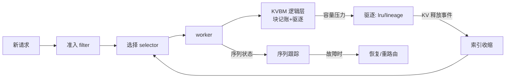

# 第 13 章 · 调度、驱逐与序列跟踪

> **适合谁读**：深入路由与容量管理的读者；这一章把第三部分收口。
> **前置**：ch10–ch12。
> **耗时**：40 分钟
> **源码锚点**：commit `61e9184`（v1.5.0）。

**学完能：**
- 区分 Dynamo 的"路由调度"与引擎内部的"batch 调度"两个层次
- 解释驱逐策略（FIFO/LRU/lineage）在 KVBM 逻辑层的角色
- 描述序列跟踪（sequence tracking）如何支撑可观测性与在途容错

---

## 13.1 两个"调度"，不要混淆

| | 引擎内调度 | Dynamo 路由调度 |
|---|-----------|----------------|
| 对象 | batch 里放哪些序列、每步算什么 | 请求发给哪个 worker |
| 位置 | vLLM/SGLang 内部（参见 vLLM 手册） | `lib/kv-router/src/scheduling/` |
| 时间尺度 | 每 step | 每请求 |

Dynamo 不越权管引擎内部 batch；它在"请求 → worker"这一层做准入与排队：

```
lib/kv-router/src/scheduling/
├── queue.rs           # 队列抽象
├── policy.rs          # FCFS / 优先级等策略
├── policy_queue.rs    # 策略×队列组合
├── filter.rs          # 准入过滤
├── prefill_load.rs    # prefill 负载形态
├── overlap.rs         # 分离模式的重叠调度
└── selector/          # ch12 已讲的选择器
```

## 13.2 队列与策略

`policy.rs` 提供可切换策略（FCFS、优先级类）。与 vLLM 内部调度同源的思考题：
**优先级调度可能饿死低优先级**——Dynamo 的处理方式同样是aging/加权一类
经典手段，具体以源码为准。`filter.rs` 在入队前做容量/健康过滤：满载的
worker 不该再排队（与 ch12 的负载项二选一生效或叠加，取决于模式）。

`overlap.rs` 是分离模式特供：prefill 完成的瞬间 decode 应立即接力，
队列要允许"接力请求"插队——为 ch14 埋点。

## 13.3 驱逐：谁扔 KV、按什么顺序扔

驱逐发生在 **worker/KVBM 一侧**（索引只是记账，见 ch11）：

```
lib/kvbm-logical/src/pools/inactive/backends/
├── fifo.rs
├── lru_backend.rs
├── multi_lru_backend.rs
└── lineage/eviction.rs     # 谱系感知驱逐
lib/kv-router/src/indexer/approximate_lru.rs   # 索引侧近似 LRU 视角
```

- **FIFO**：实现最简，冷启动/测试用。
- **LRU（及 multi-LRU）**：按最后命中淘汰；`approximate_lru` 说明精确 LRU
  的簿记成本在大规模下不可接受。
- **lineage（谱系）**：利用"这个块是从哪条序列分叉出来的"家谱信息——
  多轮对话的祖先块价值高（大概率被下一轮命中），叶子块价值低。这是
  对话型负载相对纯 LRU 的关键改进。

驱逐与路由的联动：worker 持续驱逐 → KV 事件（释放）→ 索引收缩 → 路由
候选变化。**驱逐策略实际上是隐式的路由策略**——你扔掉的缓存决定了未来
命中不了什么。

## 13.4 序列跟踪

```
lib/kv-router/src/sequences/
├── single.rs          # 单 worker 视角的序列状态
├── multi_worker.rs    # 跨 worker（分离接力的序列两段）
├── block_tracker.rs   # 块级跟踪
├── prompt_registry.rs # prompt → 序列映射
├── prefill_tracker.rs # prefill 段跟踪
└── replica_sync.rs    # 副本间同步
lib/llm/src/kv_router/indexer/    # LLM 侧：记录/查询/恢复
```

序列跟踪回答："**这条请求现在走到哪了？**"——在聚合模式下是一段
（worker-w 正在生成），在分离模式下是两段（prefill 段 + decode 段，见 ch14）。

它的三个消费者：

1. **可观测性**：在途序列数、阶段耗时（对接 ch21 指标）。
2. **在途容错**：worker 崩溃时，跟踪记录告诉你哪些请求在途、prefill 是否
   已完成、能否直接重路由（`lib/kv-router/src/recovery/` + 
   `lib/llm/src/kv_router/indexer/` 的恢复逻辑；`tests/fault_tolerance/`
   是验收）。
3. **接力（handoff）**：`prefill_tracker.rs` 记录"prefill 完成但尚未被 decode
   接走"的序列——分离模式的对接面。

## 13.5 容量视角：这一切拼成什么



容量不够时的两条出路：**本地驱逐腾地方**（本节）或**跨层下放**（CPU/SSD，
ch16）或**扩容**（Planner，ch21）。驱逐策略质量决定了"扩容按钮"被按下去的
频率。

## 小结

- 两个调度层次：引擎内 batch 调度（不归 Dynamo 管）与路由调度（本部分）。
- 驱逐在 worker/KVBM 侧执行，策略谱系 FIFO→LRU→lineage，本质是隐式路由策略。
- 序列跟踪支撑观测、容错、接力三个消费者，是第三与第四部分的桥。

## 自检（4 题，自答）

1. "Dynamo 抢占了 vLLM 的 continuous batching"——这句话错在哪？
2. lineage 驱逐为什么在多轮对话负载下优于纯 LRU？什么负载下无差别？
3. 在途容错需要序列跟踪提供哪三个事实才能决定"重路由而不是重算"？
4. 驱逐策略如何影响未来 5 分钟的路由命中率？用因果链回答。

## 下一步（跳转推荐）

- → [ch14 PD 分离架构](../04-disagg/ch14-pd-disagg.md)（序列两段化）
- → [ch16 KVBM](../04-disagg/ch16-kvbm.md)（驱逐的完整版）
