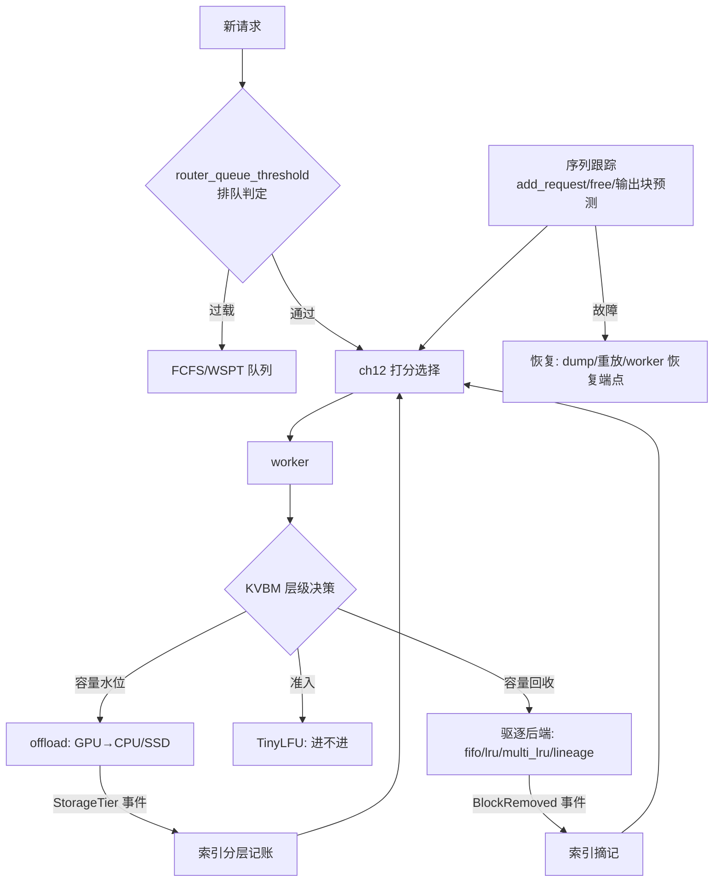

# 第 13 章 · 调度、驱逐与序列跟踪（源码深读版）

> **适合谁读**：深入路由与容量管理的读者；这一章把第三部分收口。
> **前置**：ch10–ch12。
> **耗时**：55 分钟
> **源码锚点**：commit `61e9184`（v1.5.0）。

**学完能：**
- 解释 FCFS vs WSPT 两种队列策略各自优化的目标函数，知道何时切换
- 说出路由侧序列跟踪记账的四个开关及其默认值、各自换什么
- 区分"路由侧 TTL 记账"与"KVBM 驱逐后端"两级驱逐，并按行为选后端

---

## 13.1 路由队列：FCFS vs WSPT

ch12 的调用链里，`find_best_match` 之前请求要先过路由内建的调度队列
（`SchedulerQueueActor`——公式日志注释里提过，打分在这个 actor 任务里执行）。
策略由 `router_queue_policy` 选择（`scheduling/config.rs:454`）：

| 策略 | 算法 | 优化目标 | 备注 |
|------|------|----------|------|
| `fcfs`（默认） | 先来先服务 + 优先级加塞（`priority_jump`/`strict_priority`，ch12 输入） | **尾部 TTFT**（P99） | 长请求不会饿死，但平均等待差 |
| `wspt` | 加权最短处理时间（Smith's rule）：按 `处理时间/权重` 升序 | **平均 TTFT** | 调度论经典结论 |

> Smith's rule 是单机调度里 `ΣwⱼCⱼ`（加权完成时间和）的最优解。映射到
> 推理：短请求优先 → 平均 TTFT 下降；代价是长请求尾部变差。选哪个取决于
> 你的 SLO 写的是 P50 还是 P99。配置注释原话：*"fcfs … optimizes tail TTFT.
> wspt … optimizes average TTFT."*

**排队触发条件**是 `router_queue_threshold: Option<f64>`（默认 `None` =
不排队，直接全走 ready）：设为 0.6 表示"所有候选 worker 的 prefill token
水位都超过其 `max_num_batched_tokens` 的 60%"时请求进入队列而不是硬塞给
最不忙的那个。配合 ch12 的 `QueueRejected` 出口，这是过载背压的第一道闸。

## 13.2 序列跟踪：路由的"在途账本"

`KvRouter` 上的一组方法（`lib/llm/src/kv_router.rs:1862-1978`）就是账本的
借贷方向：

```rust
pub async fn add_request(&self, ...)                       // 请求被接受：登记在途
pub async fn mark_prefill_completed(&self, request_id)     // prefill 完成（分离接力点）
pub async fn free(&self, request_id)                       // 请求结束：释放
pub async fn free_if_worker(&self, ...)                    // 仅当仍在原 worker 时释放（防误释放迁移后的序列）
pub fn pending_count(&self) -> usize                       // 在途数
pub fn pending_isl_tokens(&self) -> usize                  // 在途输入 token 数
```

底层结构在 `lib/kv-router/src/sequences/`：`single.rs`（`ActiveSequences`，
聚合视角单段跟踪）、`multi_worker.rs`（分离模式两段跟踪）、`block_tracker.rs`
（块级）、`prompt_registry.rs`、`prefill_tracker.rs`（等待接力的 prefill 完成
序列——ch14 的对接面）、`replica_sync.rs`（多路由副本间的账本同步，
`router_replica_sync` 控制）。

四个记账开关（默认值见 `config.rs` Default impl）：

| 开关 | 默认 | 语义 |
|------|------|------|
| `router_track_active_blocks` | true | 路由侧跟踪活跃块（`DYN_ROUTER_TRACK_ACTIVE_BLOCKS`） |
| `router_track_prefill_tokens` | true | 在途 prefill token 计入负载（ch12 衰减公式吃的就是这个数） |
| `router_track_output_blocks` | false | 生成期占位块跟踪：随输出推进按 `agent_hints.osl` 做**分数衰减**——预测"这条请求最终会占多少 KV" |
| `router_assume_kv_reuse` | true | true=算真实块哈希；false=**随机哈希**（假设完全无复用，用于对照实验/无前缀负载下省哈希开销） |

`router_track_output_blocks` 的思路值得咀嚼：decode 请求的 KV 占地是**持续
增长**的，只看当前块数会系统性低估长生成请求。按输出进度向目标 osl 插值
（fractional decay），让打分看到"将来会多大"。这与 KVBM 的 lineage 驱逐
（13.4）构成同一思想在两端的实现：一个预测未来占地，一个尊重历史价值。

**恢复**：`dump_events()`（`kv_router.rs:2237`）+ ch11 的
`dump_tree_as_events()`——账本与索引都可导出重放；worker 侧还有 ch10 的
恢复端点。`tests/fault_tolerance/` 验收这些路径。

## 13.3 路由侧的"软驱逐"：TTL 记账

没有 KV 事件时（`use_kv_events=false`），索引里的块记录靠
`router_ttl_secs`（默认 **120.0** 秒）过期——纯时间衰减的乐观记账。
有 KV 事件时（默认路径），块的生灭由事件驱动，TTL 不参与——
**"驱逐"的真相在 worker 侧**，路由只是记账员。

## 13.4 worker 侧驱逐：KVBM 后端

真正扔 KV 的是 `lib/kvbm-logical/src/pools/inactive/backends/`：

```
backends/
├── fifo.rs               # 先进先出
├── lru_backend.rs        # LRU
├── multi_lru_backend.rs  # 多队列 LRU（分代）
├── hashmap_backend.rs    # 简单池
├── lineage/eviction.rs   # 谱系感知驱逐
└── reuse_policy.rs       # 复用策略
```

三个层次的选择逻辑：

1. **FIFO/哈希池**：测试与语义最简场景。
2. **LRU 家族**：按最近命中。`multi_lru` 是分代变体（近似"新宠/旧爱"分队列，
   抗扫描污染——一遍顺序扫描不会把热前缀全冲掉）。
3. **lineage（谱系）**：利用序列家谱（ch11 的链接哈希天然编码了"这块从哪条
   序列分叉"）：多轮对话的**祖先块**（大概率被下一轮命中）保，**叶子块**
   （一次性输出尾块）先扔。这是对话型负载相对纯 LRU 的关键增益。

守门员是 `lib/kvbm-logical/src/tinylfu.rs`（TinyLFU 风格的**准入**而非驱逐）：
新块想进缓存先过频率门槛——**"让不让他进来"和"把谁扔出去"是两个正交
决策**， TinyLFU 准入 + LRU/lineage 驱逐组合使用。索引侧的对应物是
`ApproximateCachePolicyKind`（`router_approximate_cache_policy`）与
`KvIndexer::new_with_approximate_retention(...)`——路由索引的容量管理。

> **驱逐即路由**：现在你能精确说出这条因果链了——
> 驱逐后端决定哪些块消失 → `BlockRemoved` 事件 → 索引摘记 → 下一次
> `find_matches` 的 overlap 变小 → 打分重新洗牌。换驱逐策略 = 隐式改写
> 未来所有请求的打分输入。

## 13.5 两级驱逐全景



与入门视角相比，这里新加入的两块拼图：排队判定（13.1）和准入 vs 驱逐的分离（13.4）。

## 13.6 配置速查（本章相关）

| 旋钮 | 默认 | 环境 | 章 |
|------|------|------|----|
| `router_queue_policy` | fcfs | `DYN_ROUTER_QUEUE_POLICY` | 13.1 |
| `router_queue_threshold` | None（不排队） | `DYN_ROUTER_QUEUE_THRESHOLD` | 13.1 |
| `router_ttl_secs` | 120.0（仅无事件模式） | `DYN_ROUTER_TTL_SECS` | 13.3 |
| `router_track_*` 四开关 | 见 13.2 表 | `DYN_ROUTER_TRACK_*` | 13.2 |
| `router_replica_sync` | false | `DYN_ROUTER_REPLICA_SYNC` | 13.2 |

## 小结

- 队列：fcfs 保尾部 / wspt 保平均，`router_queue_threshold` 是背压第一闸。
- 账本：`add_request → mark_prefill_completed → free` 生命周期 + 四个记账
  开关；输出块预测让打分看到"未来占地"。
- 驱逐两级：路由侧 TTL 只是无事件模式的兜底；真驱逐在 KVBM——准入
  （TinyLFU）与驱逐（fifo/lru/multi_lru/lineage）正交组合。

## 自检（6 题，自答）

1. SLO 是 P99 TTFT，用 fcfs 还是 wspt？如果产品经理同时要 P50 呢？
2. `router_queue_threshold=0.0` 与 `None` 的行为差异？
3. `router_track_output_blocks=false` 时，长生成请求在打分里被如何系统性
   误判？方向是什么？
4. TinyLFU 是驱逐策略吗？它和 lru_backend 是什么关系？
5. `free_if_worker` 为什么要带 worker 条件？联系 ch14 的迁移场景回答。
6. 设计一个实验证明"lineage 优于 LRU"：负载怎么构造、看什么指标？

## 下一步（跳转推荐）

- → [ch14 PD 分离架构](../04-disagg/ch14-pd-disagg.md)（`prefill_tracker`
  的另一半故事）
- → [ch16 KVBM](../04-disagg/ch16-kvbm.md)（13.4 的完整展开）
