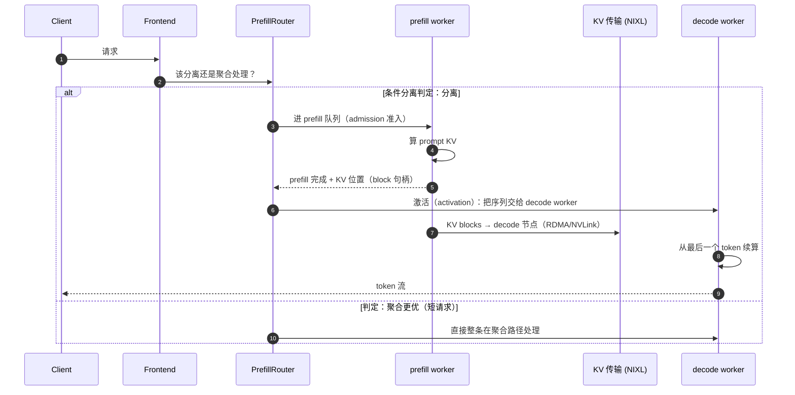

# 第 14 章 · PD 分离架构

> **适合谁读**：所有做推理服务的人（第四部分必读）。
> **前置**：ch01（两阶段特征）、ch12、ch13。
> **耗时**：50 分钟
> **源码锚点**：commit `61e9184`（v1.5.0）。

**学完能：**
- 画出 PD 分离下一条请求的三阶段时序（prefill → KV 迁移 → decode）
- 解释 `WorkerType` 四种角色与 `PrefillRouter` 的接力逻辑
- 判断什么负载/规模适合分离，什么不适合

---

## 14.1 从"为什么要分离"到"分离要解决什么"

ch01 讲过 prefill（算力受限）与 decode（带宽受限）互相干扰。分离部署后，
新问题立刻出现：

1. **接力（handoff）**：prefill 算完的请求怎么交给 decode 池？
2. **KV 迁移**：decode 需要 prompt 的 KV cache，它在 prefill 节点的显存里——
   必须跨节点搬运（ch15）。
3. **调度升级**：路由从"选一个 worker"变成"选 prefill worker + 选 decode
   worker + 决定迁移时机"。
4. **条件化**：短请求分离反而亏（迁移开销 > 收益），要能按请求特征动态决定。

## 14.2 角色模型：WorkerType

`lib/kv-router/src/worker_type.rs`（全文 168 行，已核验，值得整读）：

```rust
pub enum WorkerType {
    Prefill,    // 只做 prefill 的分离节点
    Decode,     // 只做 decode 的分离节点
    Encode,     // 多模态编码器（vision encoder）节点
    Aggregated, // 聚合：一个进程同时做 prefill+decode（经典形态）
}
```

- 每个 worker 恰好一个角色；角色与模型 API 形态正交（文档注释原意）。
- `default_selector_label()` 只区分 `prefill` / 其他（历史兼容的打分契约）。
- 序列化用小写字符串（`"prefill"`…），大小写不敏感解析。
- `lib/llm/src/worker_type.rs` 是它的再导出；`components/src/dynamo/vllm/main.py`
  在启动时声明角色（`--worker-type` 类旗标，见 ch17）。

**Encode 角色**是多模态链路的第三种分离：图像先到 encoder worker 算视觉
embedding，再进入文本 LLM——对 LLM 来说"prefill"的输入里包含了编码器产出。

## 14.3 接力：PrefillRouter

```
lib/llm/src/kv_router/prefill_router/mod.rs         # PrefillRouter（219 行，已核验）
lib/llm/src/kv_router/prefill_router/activation.rs  # 接力激活
lib/llm/src/kv_router/prefill_router/admission.rs   # 准入（何时允许进 prefill）
lib/llm/src/kv_router/prefill_router/conditional_bypass.rs
lib/kv-router/src/conditional_disagg.rs             # 条件分离
```

一条请求在分离模式下的旅程：



`conditional_disagg.rs` / `conditional_bypass.rs` 实现判定：请求太短、
prefill 池忙、或迁移代价预估不划算时，绕过分离直达聚合/decode 路径——
**分离是优化手段，不是信仰**。

## 14.4 与前几章机制的关系

| 机制 | 在分离模式下的变化 |
|------|-------------------|
| 索引（ch11） | 区分 prefill 池与 decode 池的前缀分布；接力前查"decode 池谁已有这段 KV" |
| 负载（ch12） | `prefill_load.rs`/`overlap.rs`：prefill 负载以"计算量"计量，decode 以"并发/显存"计量，两类池不能同尺度比较 |
| 序列跟踪（ch13） | `multi_worker.rs` + `prefill_tracker.rs`：一条序列两段，接力窗口 = 容错最脆弱点 |
| KV 事件（ch10） | prefill 完成事件驱动 activation，而不是靠轮询 |

## 14.5 部署形态

本地/脚本：`examples/backends/vllm/launch/disagg.sh`、`disagg_router.sh`
（分别起 prefill、decode、router）；清单：`examples/backends/vllm/deploy/
disagg.yaml`、`disagg-multinode.yaml`、`disagg_kvbm*.yaml`。K8s 上由 DGD
描述两种 worker 的独立副本数与资源（ch20）。

关键运维直觉：

- **比例**：prefill:decode 副本比由负载的输入/输出长度比决定（长进短出 →
  prefill 池大），Planner（ch21）自动化的正是这个比例。
- **排空窗口**：decode 侧在 KV 未到齐前不能开算——迁移带宽直接进入 TTFT
  （ch15 的全部意义）。
- **故障域**：接力窗口内的请求是最脆弱的（prefill 已完、decode 未起），
  恢复策略见 `lib/kv-router/src/recovery/`。

## 14.6 什么时候不该用分离

| 场景 | 判定 |
|------|------|
| 短 prompt + 短生成（如分类） | 迁移开销占比高，聚合更优 |
| 小规模（1-2 节点） | 两池各自闲置率上升，得不偿失 |
| 无 RDMA/NVLink 的网络 | KV 迁移走 TCP 会吃掉分离收益（先跑 ch15 的连通性检查） |
| 长系统提示词多轮对话 | 分离 + 前缀缓存组合收益最大（prefill 只算一次增量） |

## 小结

- 分离三阶段：prefill → KV 迁移 → decode；`WorkerType` 四角色，Encode 服务
  多模态。
- `PrefillRouter` 管接力（admission/activation），条件分离允许按请求绕过。
- 比例、排空窗口、接力脆弱点是三个运维关键词。

## 自检（5 题，自答）

1. `WorkerType::Aggregated` 与 `Prefill`/`Decode` 的区别是什么？为什么需要
   显式枚举而不是布尔"是否分离"？
2. activation 由什么事件触发？为什么不用轮询？
3. 接力窗口内 prefill worker 崩溃，与 decode worker 崩溃，恢复动作有何不同？
4. 输入 500 token、输出 2 token 的负载，分离部署的大致后果是什么？
5. Encode 角色解决什么链路问题？它对应的输入前缀发生了什么变化？

## 下一步（跳转推荐）

- → [ch15 NIXL 与 KV 传输](ch15-nixl-transfer.md)（把上图 ④ 讲透）
- → [ch17 vLLM 后端](../05-backends/ch17-vllm-backend.md)（worker 侧配合）
