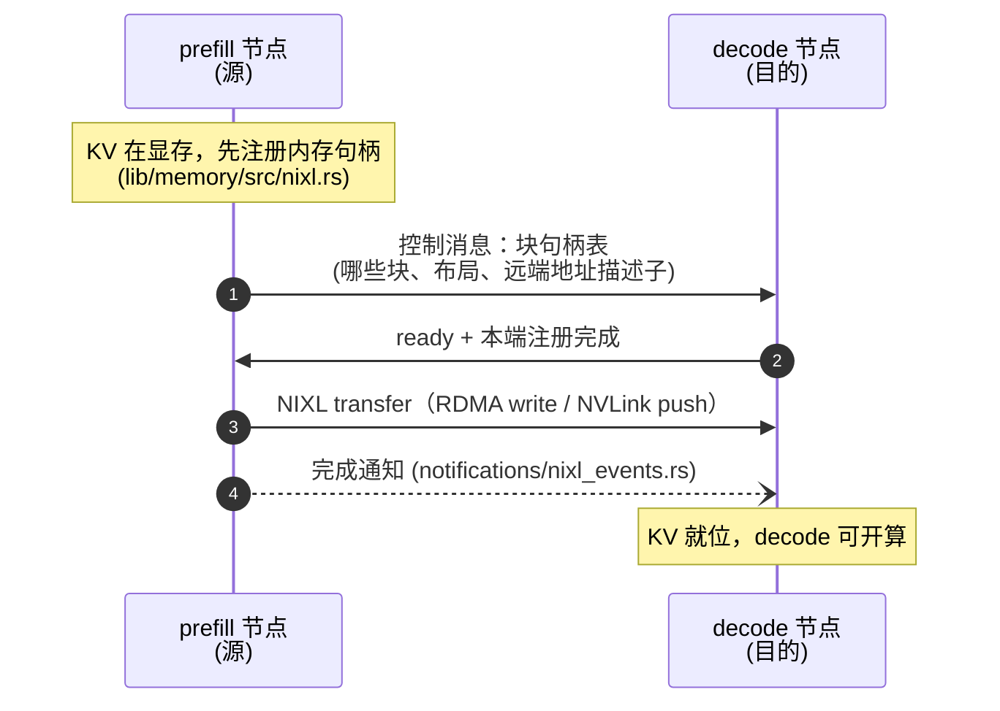

# 第 15 章 · NIXL 与 KV 传输

> **适合谁读**：做分离部署、性能调优、网络排障的读者。
> **前置**：ch14。
> **耗时**：40 分钟
> **源码锚点**：commit `61e9184`（v1.5.0）。

**学完能：**
- 描述一次 KV 迁移的两端协作（注册句柄 → 发起传输 → 通知完成）
- 指出 Dynamo 里 NIXL 相关的源码位置与 vLLM/SGLang 侧的对接文件
- 估算一次迁移要搬多少字节、判断网络是否够用

---

## 15.1 NIXL 是什么

[NIXL](https://github.com/ai-dynamo/nixl)（NVIDIA Inference Xfer Library）是
兄弟仓库，一个**高性能传输抽象层**：同一套 API 覆盖 RDMA（IB/RoCE）、
NVLink、UCX、TCP 等后端，专为推理负载的"大块 KV 搬运"设计。Dynamo 不直接
写 verbs/UCX，全部经过 NIXL。

Dynamo 侧的集成点：

```
lib/memory/src/nixl.rs                      # NIXL agent 与配置（内存注册）
lib/kvbm-physical/src/transfer/executor/nixl.rs      # 传输执行器（新版主路径）
lib/kvbm-physical/src/transfer/notifications/nixl_events.rs  # 完成通知
lib/kvbm-physical/src/transfer/executor/{cuda,memcpy}.rs     # 同机 CUDA/memcpy 执行器
lib/llm/src/block_manager/connector/        # 旧版 NIXL 连接器（legacy）
lib/bindings/python/src/dynamo/nixl_connect/  # Python 侧传输辅助
```

## 15.2 一次迁移的协作时序



三个要点：

1. **注册先行**：GPU 显存/CUDA 缓冲必须先注册进 NIXL agent 才能被远端
   直访；注册开销被摊到 worker 生命周期（池化，`lib/memory/` 的 arena 思路）。
2. **控制与数据分离**：句柄表走控制通路（毫秒级小消息），KV 字节走
   数据通路（NIXL）。
3. **完成语义**：decode 侧等到通知才算就位——这直接进入 TTFT（ch14 的
   排空窗口）。

## 15.3 要搬多少字节：算一次

回顾 ch01 的公式，一次迁移的量级（单条请求的 prompt KV）：

```
KV bytes ≈ 2 × layers × kv_heads × head_dim × prompt_len × dtype_bytes
```

例：70B 级模型（80 层、8 KV 头、128 维、FP8）× 4K token prompt：

```
2 × 80 × 8 × 128 × 4096 × 1 ≈ 671 MB
```

- 400 Gbps IB 有效 ~35 GB/s → ~19 ms；
- 25 Gbps 以太网有效 ~2.5 GB/s → ~268 ms——**TTFT 直接爆炸**。

所以分离部署的前置检查里，网络规格是第一项。仓库提供了
`dynamo-interconnect-check` 思路的校验（NIXL/UCX/NCCL 就绪性验证），
部署分离前先跑。

## 15.4 与后端的对接

worker 侧怎么知道"要接收/发送哪些块"？对接文件：

| 后端 | Dynamo 侧文件 | 说明 |
|------|--------------|------|
| vLLM | `components/src/dynamo/vllm/kv_connector_protocols.py` | `prefill_request_kv_transfer_params` / `decode_request_kv_transfer_params` / `make_kv_connector_protocol`——构造随请求携带的传输参数 |
| vLLM | `components/src/dynamo/vllm/handlers.py` | decode worker 的延迟中止防护（`_DeferredAbort`）：NIXL 在途时的 abort 要等传输收敛 |
| vLLM | `components/src/dynamo/vllm/omni/connectors/nixl_connector.py` | omni 连接器 |
| vLLM | 引擎侧 `DynamoNixlConnector` | 在外部 dynamo-vllm fork 里（不在本仓库） |
| SGLang | `components/src/dynamo/sglang/_disagg.py` | bootstrap 地址计算、prefill 预热 |
| 共享 | `lib/backend-common/src/disagg.rs` | 分离角色参数与元数据的共享定义 |
| 边车 | `lib/sidecar/{vllm,sglang,trtllm}/` | 引擎原生 API ↔ Dynamo 的 Rust 桥 |

`x-bypass-remote-prefill` 注解（vLLM handlers）允许单条请求绕过远端 prefill
 KV——与 ch14 的条件分离同思想的请求级逃生门。

## 15.5 传输执行器家族

`lib/kvbm-physical/src/transfer/executor/` 下三种执行器覆盖三种拓扑：

| 执行器 | 拓扑 | 备注 |
|--------|------|------|
| `nixl.rs` | 跨节点（RDMA/NVLink） | 分离部署主路径 |
| `cuda.rs` | 同节点 GPU 间 | 多卡单机，走 CUDA 通道 |
| `memcpy.rs` | 同设备/主机内 | 单卡或 GPU↔CPU 下放 |

统一执行器接口意味着上层（KVBM 引擎、ch16）不关心物理位置——**"搬运"被
抽象成与"计算"正交的维度**。

## 15.6 排障速查

| 症状 | 方向 |
|------|------|
| TTFT 在分离模式下暴涨 | 算字节数（15.3）；查 NIXL 后端实际选型（可能回落到 TCP） |
| 传输 hang | 完成通知通路；两端 agent 注册是否成功 |
| 接力后 decode 首批 token 错乱 | 块句柄表与布局是否一致（版本/块大小两端配置对齐） |
| abort 后资源不释放 | `_DeferredAbort` 语义：在途传输要收敛后才能回收 |

## 小结

- NIXL = 传输抽象层；Dynamo 通过 `lib/memory`（注册）与 `kvbm-physical`（执行）
  使用它。
- 迁移 = 注册句柄 → 控制消息 → 数据传输 → 完成通知；全部计入 TTFT。
- 传输执行器三兄弟（nixl/cuda/memcpy）让"搬 KV"与"在哪算"解耦。

## 自检（4 题，自答）

1. 为什么内存注册要池化摊销，而不是每次传输前注册？
2. 控制消息与 KV 数据为什么走不同通路？各自可靠性要求？
3. 用 15.3 的公式估：32B token prompt、其余同例，需要搬多少？25Gbps 下多久？
4. decode worker 收到 abort 请求但 NIXL 在途，为什么不能立刻丢弃？

## 下一步（跳转推荐）

- → [ch16 KVBM：多层 KV 管理](ch16-kvbm.md)（迁移的调度者）
- → [ch17 vLLM 后端](../05-backends/ch17-vllm-backend.md)（对接文件全走读）
