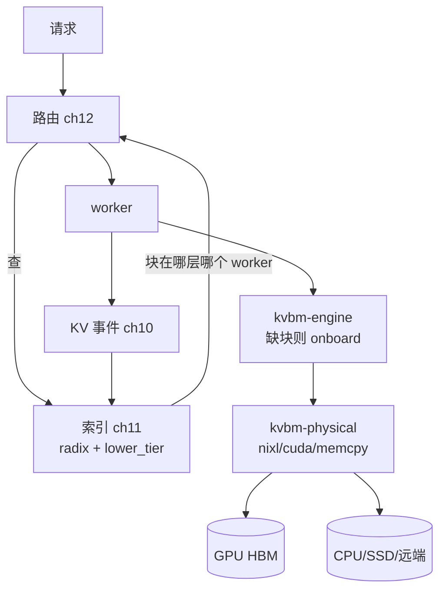

# 第 16 章 · KVBM：多层 KV 管理

> **适合谁读**：深入存储/缓存层的读者；第四部分的集大成章。
> **前置**：ch13（驱逐）、ch15（传输）。
> **耗时**：45 分钟
> **源码锚点**：commit `61e9184`（v1.5.0）。

**学完能：**
- 画出 KVBM 七个 crate 的分层（common/config/logical/physical/engine/kernels/consolidator）
- 解释一次"GPU → CPU 下放"与一次"远端命中拉回"的控制流
- 说清 KVBM 与旧 `lib/llm/src/block_manager/` 的关系

---

## 16.1 问题：KV 容量 ≠ 显存容量

第 13 章的驱逐是"显存内腾挪"。KVBM 把战场扩大到整个存储层级：

```
GPU HBM ──(快、贵、小)──> CPU 内存 ──> SSD/对象存储 ──> 远端节点 (RDMA)
```

目标：**命中率随总容量上升，而热数据始终贴近算力**。代价是每一层都要
有人记账（在哪）、搬运（怎么动）、决策（何时动）。

## 16.2 七件套地图

| crate | 职责 | 关键内容 |
|-------|------|----------|
| `lib/kvbm-common/` | 共享类型 | 层级、块、句柄的公共定义 |
| `lib/kvbm-config/` | 配置 | `nixl.rs`/`cache.rs`/`offload.rs`/`onboard.rs`/`events.rs`/`messenger.rs`——每层每动作的开关与参数 |
| `lib/kvbm-logical/` | **逻辑层** | `manager/`（构建器）、`pools/`（active 池 + inactive 池及驱逐后端 fifo/lru/multi_lru/lineage）、`events/`（发布）、`sequence/`、`registry/`、`tinylfu.rs` |
| `lib/kvbm-physical/` | **物理层** | `layout/`（KV 块布局）、`manager/{local,remote}.rs`、`transfer/executor/{nixl,cuda,memcpy}.rs`（ch15） |
| `lib/kvbm-engine/` | **引擎层** | `offload/`（下放引擎与队列）、`object/s3/`（对象存储）、`leader/`（主从/onboarding/会话）、`worker/`、`pubsub/nats.rs` |
| `lib/kvbm-kernels/` | CUDA kernel | 块级拷贝/重排（`build.rs` 编译） |
| `lib/kvbm-consolidator/` | 事件桥 | vLLM 侧 KV 事件 → 路由线格式（`ingress/zmq_subscriber.rs`、`egress/zmq_publisher.rs`） |

分层意图（对照操作系统类比）：

- **logical** = 内存管理器的页表与策略（记账、驱逐），不知道字节在哪个设备；
- **physical** = DMA 引擎与布局（搬运、寻址），不知道策略；
- **engine** = 换页守护进程（决定何时下放/上载/预取，串起前两者）。

## 16.3 两条核心控制流

### 下放（offload）：GPU → CPU/SSD


### 拉回（onboard / 远端命中）

```
路由查询发现"前缀在 worker-w 的 CPU 层" → 请求仍可发给 w
  → w 的 engine 在 prefill 前先把块从 CPU/远端拉回 GPU
  → 命中部分免算，TTFT ≈ 迁移时间（仍远小于重算）
```

`leader/` 子模块处理多副本/主从协调（谁有权搬、会话一致性），`pubsub/nats.rs`
把 KVBM 事件广播给路由侧（ch10 事件流的一个生产者）。

## 16.4 与索引、路由的闭环

把三部分串起来（全书最重要的一张闭环图）：



**索引的层级感知（ch11 `lower_tier.rs`）+ KVBM 的搬运能力 = "容量弹性"**：
命中率不再被显存封顶。而 `tinylfu.rs`（TinyLFU 类频率感知）与 lineage 驱逐
一起，决定哪些块值得留、该留在哪层。

## 16.5 新旧两代

仓库里同时存在：

- **旧**：`lib/llm/src/block_manager.rs` + `block_manager/`（system-memory +
  NIXL 远端存储，服务旧路径）；
- **新**：`lib/kvbm-*` 七件套（本 章）。

阅读与贡献优先新栈；识别旧栈的存在可以避免"改错地方"。部署侧
`examples/backends/vllm/deploy/disagg_kvbm*.yaml` 是新栈的实战清单。

## 16.6 调参与观察

- 水位阈值（offload/onboard 的触发点）：太激进 → 抖动（刚下放又拉回）；
  太保守 → 显存早爆。`kvbm-config` 各文件即各旋钮。
- 观察指标：各层命中率、下放/拉回吞吐、迁移排队延迟（ch21 的指标体系）。
- 验证工具：`tests/kvbm_integration/`、`lib/kvbm-engine/bin/bench_engine.rs`
  （引擎微基准）。

## 小结

- KVBM = 逻辑记账 + 物理搬运 + 引擎决策，OS 换页的推理版。
- 下放/拉回两条控制流由水位与命中驱动，事件广播闭环回索引。
- 新旧两代并存，新栈是未来；调参围绕水位与命中率。

## 自检（5 题，自答）

1. logical 层为什么不能知道"字节在哪个设备"？这个约束买到了什么？
2. 一次"CPU 层命中"的请求，其 TTFT 由哪些项构成？何时仍优于重算？
3. 抖动（thrashing）在 KVBM 语境下是什么？哪个旋钮直接相关？
4. `kvbm-consolidator` 在 ch10 的事件链路里处于什么位置？
5. 如果让你加一层"远端 KV 池"（跨 DC），要动哪几个 crate？

## 下一步（跳转推荐）

- → [ch17 vLLM 后端](../05-backends/ch17-vllm-backend.md)（KVBM 在 worker 侧
  的挂载点）
- → [ch21 Planner 与可观测性](../06-deploy/ch21-planner-observability.md)
