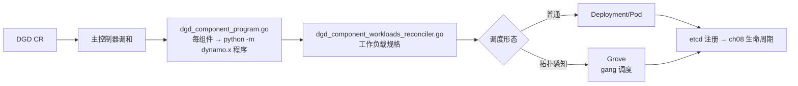

# 第 20 章 · Kubernetes Operator 与 DGD

> **适合谁读**：平台/K8s 方向的读者；所有部署 Dynamo 的运维。
> **前置**：ch05（组件进程模型）、ch08（两层"生死"）。
> **耗时**：40 分钟
> **源码锚点**：commit `61e9184`（v1.5.0）。

**学完能：**
- 解释 DynamoGraphDeployment（DGD）CRD 如何描述一张推理组件图
- 走读 Operator 的渲染管线（CRD → 组件工作负载 → Pod）
- 区分 Operator、Grove、Planner、Inference Gateway 各自管什么

---

## 20.1 从"手拉进程"到"声明式"

ch05 的本地形态是 N 个 `python -m dynamo.<x>` 进程 + etcd/NATS。生产形态
把"这张图"声明成一个 CRD 对象，Operator 负责把它变成 reality：

```yaml
# 概念化 DGD（字段以 deploy/operator/api/ 实际类型为准）
apiVersion: nvidia.com/v1alpha1
kind: DynamoGraphDeployment
spec:
  components:
    - name: frontend        # 每个组件 → 一个工作负载
      type: dynamo.frontend
      ...
    - name: vllm-worker
      type: dynamo.vllm
      workerType: aggregated   # 或 prefill/decode，各成独立组件
      replicas: 4
```

## 20.2 源码地标

```
deploy/operator/
├── cmd/main.go                       # 入口
├── api/v1alpha1/  api/v1beta1/       # CRD 类型
│    └── dynamographdeployment_types.go         # DGD
│    └── dynamocomponentdeployment_types.go     # 组件级部署
│    └── topology_types.go 等
├── internal/controller/
│    ├── dynamographdeployment_controller.go    # 主调和循环
│    ├── dgd_component_workloads_reconciler.go  # 组件→工作负载
│    ├── dgd_component_program.go               # 组件程序（python -m …）
│    ├── dgd_grove_workload_renderer.go         # Grove 渲染
│    ├── dgd_epp_reconciler.go                  # Envoy EPP
│    └── failover_cascade_controller.go 等
├── config/crd/                       # CRD yaml
deploy/helm/charts/platform/           # 总 chart（operator/epp/planner 子组件）
deploy/inference-gateway/ext-proc/     # Envoy 外部处理器（Rust）
deploy/utils/                          # v1alpha1→v1beta1 转换器
```

## 20.3 渲染管线



要点：

1. **组件 = 程序 + 参数 + 副本**。Operator 不执行任何推理逻辑，它只是把
   DGD 翻译成"跑哪些 `python -m dynamo.<name>`、多少副本、什么资源"。
2. **Grove**（兄弟仓库）在需要拓扑感知 gang 调度（多节点分离部署把
   prefill/decode 组绑定到 NVLink/RDMA 域）时接管放置。
3. **v1alpha1 vs v1beta1**：两代 API 并存，`deploy/utils/` 有转换器——读
   集群里的对象先看 apiVersion。

## 20.4 运行期的分工（全景）

| 组件 | 管 | 不管 |
|------|-----|------|
| K8s/Operator | 进程有无、副本数、重启 | 请求路径 |
| etcd/watcher（ch08） | 服务视角生死、路由表 | 进程管理 |
| Router（ch12） | 每请求去哪 | 扩缩容 |
| **Planner**（ch21） | 副本数建议→改 DGD | 直接动 Pod |
| Inference Gateway | 入口流量策略（Envoy ext-proc） | 路由语义 |
| Grove | 拓扑感知放置 | 弹性决策 |

注意 Planner 与 Operator 的闭环：Planner 观测 SLO 与负载 → 修改 DGD 的
副本/资源配置 → Operator 调和出新工作负载 → ch08 发现层跟上。**自动扩缩容
的执行链是"改声明"，不是"直接杀进程"**——这保证了任何时刻集群状态都可从
DGD 推导。

## 20.5 Inference Gateway

`deploy/inference-gateway/`（Envoy external processor，Rust 实现在
`ext-proc/src/`）：在 L7 入口做路由前置（按模型/租户/优先级分流、限流、
header 处理），是"进入 Dynamo 之前"的一跳。它配合（而非替代）Dynamo 的
KV 感知路由：gateway 管入口面，Dynamo 管模型面。另有 EPP
（`dgd_epp_reconciler.go`）在部署侧自动配好。

## 20.6 部署与验证工作流

1. 安装：`deploy/helm/charts/platform/`（含 operator、epp、planner、RBAC、
   Prometheus 配置）。
2. 提交 DGD → `kubectl get dynamographdeployments` 看状态。
3. 逐层验证（排障顺序）：
   - Pod 起来没有？（Operator/镜像/资源）
   - 进程注册进 etcd 没有？（ch08）
   - frontend 能发现 worker 吗？（watcher 日志）
   - 入口连通吗？（Gateway/Service/端口）
4. 冒烟：OpenAI 兼容请求打一轮（`tests/serve/` 的 harness 语义同款）。
5. 变更：改 DGD（副本、参数）→ 观察 ch08 的扩缩容端到端效应。

## 小结

- DGD = 推理图的声明式表达；Operator = 翻译器（图 → `python -m` 工作负载）。
- 渲染管线含 Grove（拓扑 gang 调度）与 EPP（网关）两个增强件。
- 全链条"改声明不动进程"，K8s/etcd 两层生死各司其职。

## 自检（4 题，自答）

1. Operator 渲染出的 Pod 里跑的命令行大致长什么样？为什么是它？
2. 多节点分离部署为什么需要 Grove 而不是普通 Deployment？
3. Planner 想把 decode 池从 3 扩到 5，它会"直接创建 Pod"吗？完整链路是？
4. Pod Running 但 etcd 无注册，DGD 状态可能显示什么？流量会怎样？

## 下一步（跳转推荐）

- → [ch21 Planner 与可观测性](ch21-planner-observability.md)（扩缩容的大脑）
