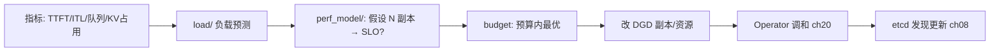

# 第 21 章 · Planner 与可观测性

> **适合谁读**：运维、容量规划、SRE 方向的读者（全书主线收口章）。
> **前置**：ch08、ch19、ch20。
> **耗时**：35 分钟
> **源码锚点**：commit `61e9184`（v1.5.0）。

**学完能：**
- 描述 Planner 的观测 → 预测 → 决策 → 执行链路及其组件
- 列出 Dynamo 的四类可观测信号与采集点
- 建立"从指标异常定位到本书前文机制"的排障地图

---

## 21.1 Planner：SLA 驱动的扩缩容大脑

```
components/src/dynamo/planner/
├── __main__.py
├── core/perf_model/        # 性能模型：给定负载预测指标
├── core/load/              # 负载观测/预测
├── core/budget.py          # 预算约束（GPU 数、成本上限）
├── simulation/             # 离线仿真
├── connectors/  plugins/   # 数据源与策略插件
components/src/dynamo/global_planner/
├── orchestrator.py             # 全局编排
├── kubernetes_capacity_manager.py  # K8s 容量执行
└── scale_handler.py            # 扩缩容处理
```

决策链路：



三个设计特征：

1. **SLA 驱动**：目标不是"CPU 利用率 80%"，而是"P99 TTFT < X ms"——
   perf_model 把负载特征（输入/输出长度分布，ch19 的 trace）映射到 SLO。
2. **预算约束**：`budget.py` 表达 GPU 总量/成本上限，优化在约束内进行。
3. **仿真先行**：`simulation/` 与生态 [AISimulate](https://pypi.org/project/aisimulate/)
   允许离线验证扩缩容策略——不拿生产集群试错。

## 21.2 可观测性：四类信号与采集点

| 信号 | 采集点 | 消费者 |
|------|--------|--------|
| HTTP 指标（QPS/延迟/错误） | `lib/llm/src/http/service/metrics.rs` | 监控/Planner |
| 路由与队列指标 | `lib/llm/src/kv_router/metrics.rs`、scheduling 队列 | Planner、排障 |
| Worker 负载与 KV 状态 | `publisher/worker_metrics.rs`（ch10 指标流） | 路由（ch12）、Planner |
| KVBM 分层指标（各层命中/迁移） | kvbm 事件（ch16） | 容量调参 |

基础设施：`deploy/observability/`（Grafana 面板、日志）、Prometheus 配置在
operator chart（`templates/prometheus.yaml`）；本地开发有
`dev/docker-observability.yml`。SLA 剖析工具：`dynamo.profiler`
（`profile_sla.py`，rapid/thorough 两档）。

## 21.3 排障地图：症状 → 章

把全书机制压缩成一张 SRE 视角的索引：

| 症状 | 先看 | 深入 |
|------|------|------|
| TTFT 高、ITL 正常 | prefill 拥挤 | ch14 比例、ch11 命中率、ch12 负载项 |
| ITL 高、TTFT 正常 | decode 拥挤 | ch14 decode 池、ch16 显存水位 |
| 命中率低但负载重复度高 | 索引/事件断了 | ch10 事件平面、ch17 kv_hints 一致性 |
| 分离模式 TTFT 抖动 | 迁移带宽 | ch15 字节估算、interconnect 检查 |
| 扩容了没流量 | 发现层断点 | ch08 检查清单 |
| worker 频繁被驱逐缓存 | 驱逐策略 | ch13/16 水位与策略 |
| 在途请求批量失败 | 容错路径 | ch13 序列跟踪、recovery |

## 21.4 容量规划实操框架

1. **刻画负载**：输入/输出长度分布、到达率、前缀重复度（ch19 trace 工具）。
2. **基线测量**：单聚合 worker 的 TTFT/ITL 曲线（profiler）。
3. **拓扑决策**：该负载分离是否划算（ch14 判定表）。
4. **比例搜索**：perf_model / AISimulate 离线扫 prefill:decode 比例。
5. **上线验证**：AIPerf 跑同 workload 的对比（ch19）。
6. **闭环**：Planner 接管日常弹性，SLO 违例告警。

## 21.5 在途容错与故障演练

- 机制：lease 过期（ch08）→ 序列跟踪定位在途请求（ch13）→ 恢复/重路由
  （`lib/kv-router/src/recovery/`）。
- 验收：`tests/fault_tolerance/`、`failover_cascade_controller.go`
  （防止级联误切换）。
- 演练建议：生产前用 mocker 拓扑做"杀 worker"演练（ch19 环境 + ch08 观察），
  确认排空窗口与恢复时间符合 SLO。

## 小结

- Planner = 负载预测 × 性能模型 ÷ 预算 → 改 DGD，绝不直接动进程。
- 四类信号各有采集点；排障地图把症状映射回机制章。
- 容量规划六步：负载刻画→基线→拓扑→比例→验证→闭环。

## 自检（4 题，自答）

1. Planner 为什么以 SLO 而不是利用率为目标？利用率驱动在推理负载下会
   出什么系统性错误？
2. 从"P99 TTFT 违例"告警到定位根因，你会按什么顺序查哪四类信号？
3. 扩缩容执行链上，哪一步之后流量才会真正变化？为什么有延迟？
4. 哪些容量结论必须在线验证、哪些可以离线（仿真）得出？

## 下一步（跳转推荐）

- → [附录 B 全书自检清单](../appendix/B-self-check.md)（检验学习成果）
- → 回 [README](../README.md) 重走你感兴趣的主线
