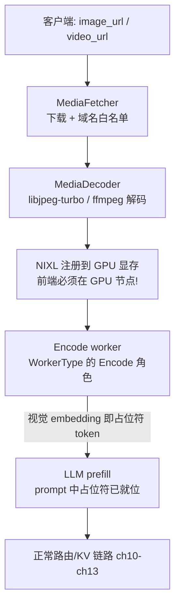

# 第 22 章 · 多模态推理链路：从前端解码到编码器路由

> **适合谁读**：要跑图文/视频模型（Qwen-VL 类）的工程师；想理解 `WorkerType::Encode`
> 到底干什么的人。
> **前置**：ch09（前处理）、ch10（KV 事件）、ch14（Encode 角色）。
> **耗时**：45 分钟
> **源码锚点**：commit `61e9184`（v1.5.0）。媒体链路细节大量引自
> `lib/llm/src/preprocessor/media/README.md`（官方文档，值得通读）。

**学完能：**
- 画出 image_url 从 HTTP 请求到 LLM prefill 的完整数据流
- 说清多模态在路由/索引层的三个特殊机制（占位符归一化、块级 MM 记账、
  嵌入缓存）
- 避开部署侧的四个官方警告（前端要 GPU、镜像限制、编解码白名单、运行时参数）

---

## 22.1 全链路



各段的源码归属：

| 段 | 位置 | 要点 |
|----|------|------|
| 抓取 | `lib/llm/src/preprocessor/media/loader.rs` | `MediaFetcher`：user_agent、超时、`allow_direct_ip/port`、`allowed_media_domains` 白名单——**SSRF 防线** |
| 解码 | `media/decoders.rs` + `jpeg_turbo.rs` | 图片默认 libjpeg-turbo（`DYN_MM_ENABLE_LIBJPEG=0` 可退回 `image` crate）；视频走 ffmpeg（见 22.4） |
| 显存注册 | `media/rdma.rs` | 解码后的张量经 NIXL 写入 GPU 内存，后端通过 NIXL 直接取——**像素数据不过消息总线** |
| 编码器 | `examples/custom_encoder/qwen_vision_encoder.py` 等 | 独立 vision encoder worker（`WorkerType::Encode`，ch14） |
| 路由记账 | ch10/ch11 的 MM 字段 | 见 22.2 |

**启用方式**（Python 侧注册，摘自官方 README）：

```python
from dynamo.llm import MediaFetcher, MediaDecoder
fetcher = MediaFetcher()
fetcher.allowed_media_domains(["google.com"])
decoder = MediaDecoder()
decoder.enable_image({"limits": {"max_image_width": 4096, "max_alloc": 16*1024*1024}})
decoder.enable_video({"fps": 2.0, "max_frames": 128, "limits": {...}})
register_model(..., media_decoder=decoder, media_fetcher=fetcher)
```

没调用 `enable_image/enable_video`，对应模态的请求会被直接拒绝——能力是
显式声明的，不是自动探测。

## 22.2 路由与索引层的三个 MM 机制

多模态不只是"前置多一步解码"，它渗透进了第三部分的机制里：

**① 占位符哈希归一化**（ch10 讲过源头，这里看动机）。prompt 里的图像
占位符 token（如 `<|image_pad|>` 展开成 N 个 pad token）在不同引擎里
id 方案不同。`KvEventPublisher` 的 ZMQ 监听器用注册时传入的
`image_token_id` / `video_token_id` 把 vLLM 的 `BlockStored` 哈希改写为
Dynamo 规范 pad 方案——否则同一张图在引擎侧和路由侧算出两个身份，
前缀命中永远对不上。`None`（纯文本部署）时是空操作。

**② 块级 MM 记账**（`lib/kv-router/src/protocols.rs`）。请求级与块级的
多模态对象信息：

```rust
pub struct RequestMmObjectInfo {
    pub mm_hash: u64,                       // 多模态对象身份（如图像哈希）
    pub offsets: Vec<(usize, usize)>,       // 占位符在【整个请求】中的区间
}
// RequestExtraInfo::to_block_level(block_size, total_tokens)
//   → Vec<Option<BlockExtraInfo>>  换算到每个块内的局部偏移
```

`to_block_level` 做的事：把请求级区间按块大小切分，落在第 i 块内的部分
记为块内偏移。这样**包含图像占位符的块**在索引里携带 `mm_objects` 元数据
——路由侧能知道"这个前缀块里有图"，处理位置敏感匹配（ch11 `positional.rs`）
与嵌入缓存都有用。

**③ 多模态嵌入缓存**。`lib/llm/src/kv_router/publisher/` 导出
`MultimodalEmbeddingCachePublisher` 与配套事件（`publisher/mod.rs:48`），
配合 `lib/llm/src/kv_router/indexer/` 的 embedding cache：同一张图
（同一 `mm_hash`）的视觉 embedding 不必每次重算——它比文本前缀更值得缓存，
因为图像编码开销远大于等长 token 的 prefill。

## 22.3 编码器 worker：Encode 角色

ch14 的 `WorkerType::Encode` 在这里落地：视觉编码是独立的一类计算
（ViT 前向），Dynamo 允许把它部署成独立的 worker 池。仓库自带三个
参考实现（`examples/custom_encoder/`）：

```
qwen_vision_encoder.py        # Qwen-VL 系视觉编码器
qwen3_5_vision_encoder.py
hitchhikers_vision_encoder.py
```

它们把图像张量（经 NIXL 从前端直达）编码成 LLM 输入格式的 embedding，
产出占位符位置的 KV，然后 LLM prefill 在这些块之后继续。对路由器来说，
编码器产出的块和普通 prefill 块一样进索引、参与命中——**多模态请求的
"前缀复用"包含视觉部分**（同一张图 + 同一系统提示词的反复提问是典型
Agent 负载）。

## 22.4 部署侧的四个官方警告

全部来自 `media/README.md`，生产前必读：

1. **前端必须在 GPU 节点**：解码张量经 NIXL 写 GPU 内存，需要
   `libcuda.so.1`；CPU-only 节点会报
   `Failed to initialize required backends: [UCX: No UCX plugin found]`。
   "前端是轻量 CPU 服务"的常规假设在多模态下不成立。
2. **`Dockerfile.frontend` 不兼容**：独立前端镜像不含 NIXL/UCX 与
   `libturbojpeg` 运行库。
3. **视频解码器白名单很窄**：ffmpeg 以 `media-ffmpeg` feature 构建，
   只带 VP8/VP9（mp4/webm/mkv）的软解；**H.264/H.265 故意不解码**
   （NVDEC `h264_cuvid/hevc_cuvid` 尚未接线）。发 H.264 视频会失败，
   先转码。
4. **限制不可运行时覆盖**：`max_image_width/height`、`max_alloc` 等
   防炸内存的限制注册时固定；**可**按请求覆盖的是采样参数——
   `media_io_kwargs`（请求体扩展字段，如
   `{"video": {"fps": 1.0, "max_frames": 16}}`）。

路线图（README TODO）：音频解码、NVDEC/nvJPEG 硬解、内存分层下放都
未完成——排障时先确认你踩的不是 TODO。

## 22.5 动手

1. 读 `examples/custom_encoder/launch/` 的启动脚本，看 encoder/LLM 两个
   worker 怎么组网（同一 etcd/NATS）。
2. 用带图请求打 mocker（若配置了 MM），观察请求体里 `media_io_kwargs`
   的透传与拒绝路径（不 enable_image 直接 4xx）。
3. 对照 ch10 的 `image_token_id` 参数，想清楚：换一个 pad 方案不同的
   引擎版本，为什么必须同步改这个注册参数？

## 小结

- 链路：抓取（SSRF 白名单）→ 解码（turbojpeg/ffmpeg）→ NIXL 直达显存 →
  Encode worker → LLM prefill；像素不走消息总线。
- 路由层三机制：占位符哈希归一化、块级 MM 记账（`to_block_level`）、
  嵌入缓存。
- 四个部署警告：前端要 GPU、镜像限制、VP8/VP9 白名单、限制不可运行时改。

## 自检（4 题，自答）

1. 为什么像素数据走 NIXL 而不是组件间的请求平面？（对照 ch07 的
   max_payload 讨论）
2. 同一张图在 vLLM 侧和路由侧块哈希不一致，故障表现是什么？根因在哪个
   参数？
3. `to_block_level` 为什么要做请求级→块级的偏移换算？谁消费这个信息？
4. 多模态负载下，嵌入缓存与文本前缀缓存哪个收益上限更高？为什么？

## 下一步（跳转推荐）

- → [ch23 LoRA 适配器管理](ch23-lora.md)（另一种"身份影响哈希"的机制）
- → 回 [ch10 KV 事件](../03-kv-routing/ch10-kv-events.md) 看 image_token_id
  的原始上下文
