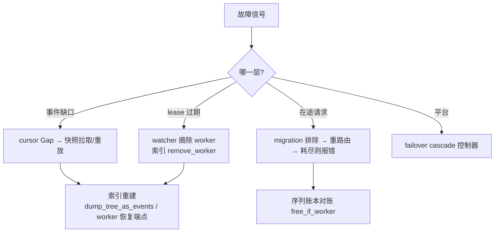

# 第 24 章 · 容错、迁移与恢复

> **适合谁读**：所有要上生产的读者；SRE 必读。
> **前置**：ch08（生死检测）、ch10（事件流）、ch13（序列账本）。
> **耗时**：45 分钟
> **源码锚点**：commit `61e9184`（v1.5.0）。

**学完能：**
- 把"worker 挂了"拆成五个子问题并各自指出机制与源码
- 解释事件流游标（`recovery/cursor.rs`）如何检测缺口与陈旧回放
- 说清在途请求的请求级故障切换（migration 排除链）怎么工作

---

## 24.1 拆解"worker 挂了"

一句话的"挂了"在系统里是五个独立问题：

| 子问题 | 机制 | 源码 |
|--------|------|------|
| ① 谁先知道？ | etcd lease 过期（无独立心跳，ch08） | `lib/runtime/src/transports/etcd/lease.rs` |
| ② 事件流断在哪？ | 单调事件号 + 游标状态机 | `lib/kv-router/src/recovery/cursor.rs` |
| ③ 索引怎么清账？ | worker 摘除（`remove_worker*`，ch11） | `indexer/radix_tree.rs:665` |
| ④ 在途请求怎么办？ | 序列账本 + 迁移排除 + 请求级重路由 | ch13 + `protocols/common/preprocessor.rs:153` |
| ⑤ 平台层怎么防雪崩？ | 故障切换级联控制器 | `deploy/operator/internal/controller/failover_cascade_controller.go` |

## 24.2 事件流完整性：游标状态机

ch10 埋的伏笔（`next_event_id: AtomicU64` 单调编号）在这里兑现。
`lib/kv-router/src/recovery/cursor.rs`（96 行，含测试，可通读）：

```rust
pub enum CursorState { Initial, Live(u64) }

pub enum CursorObservation {
    Initial    { got: u64 },                    // 第一条：无法判定连续性
    Contiguous { got: u64 },                    // got == last+1，正常推进
    Gap        { expected: u64, got: u64 },     // 丢了一段 → 触发恢复
    Stale      { got: u64, last_applied: ... }, // 旧事件重放/重复投递，丢弃
}
```

四个分支对应四种现实：

- **Contiguous**：正常推进，`advance_to(got)`。
- **Gap**：ZMQ/事件平面丢了中间事件。恢复手段按代价升级：worker 恢复
  端点拉快照（ch10 的 `start_worker_kv_query_endpoint`）→ `dump_events()`
  重放（ch13）→ 最坏情况接受索引短暂不准（ch10 的尽力而为语义兜底）。
- **Stale**：发布器重发/多订阅投递的旧事件——幂等丢弃。注意它和 Gap
  的方向相反：Stale 是"见过的"，Gap 是"缺了的"。
- **Initial**：聪明的诚实——第一条事件无法验证连续性，不假装能。

这与 ch10 的"发布器生死耦合"文档注释呼应：引擎重启必须 `Cleared` 或换
publisher_id，游标状态机是消费侧对这类事件的检测面。

## 24.3 在途请求：序列账本与迁移排除

ch13 的账本（`add_request → mark_prefill_completed → free`）在故障时
变成"受损清单"。恢复路径的骨干在请求侧的迁移状态
（`lib/llm/src/protocols/common/preprocessor.rs:153`）：

```rust
// PreprocessedRequest.migration_state
pub(crate) fn excluded_worker_ids(&self) -> Vec<WorkerId> { ... }
// 以及 exhausted_error()：排除链耗尽时的最终错误
```

ch12 的 `select_worker_outcome` 消费它（`kv_selection.rs:209-231`）：

1. 请求曾在 worker-A 失败 → `migration_state` 记录排除集合；
2. 重路由时从 `allowed_worker_ids` 里剔除 A（并结合 taints 相容性）；
3. 剔除后为空 → `exhausted_error()` 上抛为明确错误，而不是无限重试。

配套细节：

- **`free_if_worker`**（`kv_router.rs:1946`）：释放序列时校验"仍在原
  worker"——请求已迁移到 B 后，A 侧的迟到释放不能误删 B 的记账。
- **亲和 pin 与瞬时过载**：故障切换语义下，亲和校验故意忽略瞬时过载
  （`kv_selection.rs` 测试 `affinity_validation_ignores_transient_overload`）
  ——粘性让位于可用性的场景由显式 pin 路径处理。
- **decode 侧的中止防护**（ch17 的 `_DeferredAbort`）：NIXL 在途时 abort
  要等传输收敛——故障切换不能以留下悬空块句柄为代价。

## 24.4 平台层：防级联

K8s 层的 `failover_cascade_controller.go` 防的是**二次雪崩**：一个 worker
故障 → 流量重路由 → 剩余 worker 过载 → 健康检查失败 → 更多"故障"……
控制器在切换动作与过载信号之间加协调闸。运行侧的两条经验：

1. **两层生死观**（ch08）：Pod 重启不等于服务恢复——lease 重新注册、
   watcher 收录、KV 指标接入之前，别急着宣布恢复。
2. **排空窗口**（ch14）：分离模式接力窗口内的请求最脆弱；容量规划时
   把"单 worker 故障的恢复时间"当 SLO 项（ch21 演练建议）。

## 24.5 验收：`tests/fault_tolerance/`

这个目录就是容错行为的规格书：

```
tests/fault_tolerance/
├── etcd_ha/        # etcd 高可用：vllm/sglang/trtllm 各一套 + utils.py
├── migration/      # 迁移/重路由场景
├── cancellation/   # 取消与中止
├── hardware/       # 硬件级故障注入
├── test_vllm_health_check.py
├── test_unified_canary.py / test_canary_rank_pause.py   # 金丝雀与暂停
```

**canary（金丝雀）**值得单独说：`test_canary_rank_pause.py` 验证的是
"暂停某个 dp_rank 的流量而不摘除它"——这是比硬故障更精细的运维动作
（版本灰度、热点隔离），说明 Dynamo 把"可暂停性"做成了路由的一等能力
（与 ch12 的 `allowed_worker_ids`/pin 机制同源）。

给自己环境的验收顺序：杀 worker（观察 24.3 链路）→ 注入事件缺口
（观察 24.2 游标）→ 金丝雀暂停一个 rank（观察流量归零与恢复）。

## 24.6 恢复能力全景图



## 小结

- 五问拆解：检测（lease）、事件完整性（游标四态）、索引清账
  （remove_worker）、在途（迁移排除链）、平台（级联闸）。
- 游标状态机把"尽力而为"变成**可检测的**尽力而为：Gap 有恢复路径，
  Stale 有幂等丢弃。
- `tests/fault_tolerance/` 是行为规格；金丝雀暂停是精细运维的一等能力。

## 自检（4 题，自答）

1. Gap 和 Stale 的区别是什么？各自的安全处置为什么不同？
2. 为什么 `free` 要带 `if_worker` 条件？画一个不加条件会出错的时序。
3. 迁移排除链"耗尽"时为什么选择显式报错而不是清空集合重试一轮？
4. 金丝雀暂停与直接杀 worker，对索引和路由的影响差异是什么？

## 下一步（跳转推荐）

- → [ch25 共享缓存与跨数据中心 KV](ch25-shared-cache-dc.md)
- → [ch26 测试体系与 CI](ch26-testing-ci.md)（把 fault_tolerance 测试跑起来）
