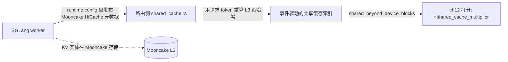

# 第 25 章 · 共享缓存与跨数据中心 KV

> **适合谁读**：做大集群/多池/多 DC 推理的读者。
> **前置**：ch11（分层命中）、ch12（打分公式）、ch16（KVBM）。
> **耗时**：40 分钟
> **源码锚点**：commit `61e9184`（v1.5.0）。

**学完能：**
- 解释"共享缓存命中"在打分公式里的位置与定价（为什么是 0.5）
- 描述 SGLang HiCache + Mooncake 的接入方式（`shared_cache.rs` 的设计）
- 区分四种"超越单 worker 显存"的路径及其组合关系

---

## 25.1 为什么需要"共享"

到此为止的命中都假设"块在某个 worker 的显存里"。三个场景打破这个假设：

1. worker 副本多、请求分散：同一前缀被不同副本各自算了一遍——需要一个
   **跨 worker 的共享层**（L3）。
2. KVBM 已经下放的块（CPU/SSD，ch16）：命中但需要搬回。
3. 多数据中心：A 区算过的前缀，B 区的请求也想用——**跨 DC 的 KV 中继**。

Dynamo 的回答是四条正交路径，可以组合：

| 路径 | 机制 | 章 |
|------|------|-----|
| 共享缓存（hicache） | 路由侧维护 SGLang/Mooncake L3 的索引，命中按折扣计价 | 本章 |
| KVBM 分层 | 块在 CPU/SSD，命中权重 0.75/0.25 | ch16 |
| 远端索引 | cuckoo filter 跨池粗筛 | ch11 |
| DC 中继 | kv_dc_relay 跨区搬运 | 本章 |

## 25.2 HiCache：SGLang + Mooncake 的 L3 客户端

`lib/llm/src/kv_router/shared_cache.rs`（1154 行）的模块注释就是设计
文档：

```text
//! HiCache shared KV cache client for SGLang + Mooncake.
//! 1. Reads Mooncake HiCache metadata published by SGLang workers in runtime config.
//! 2. Recomputes the logical HiCache page hashes from request tokens using the ...
```

工作方式：



三个实现细节值得学（都有源码行为佐证）：

1. **元数据走发现通道**：SGLang worker 把 HiCache 布局信息放进 runtime
   config 发布（键 `sglang_hicache_mooncake`，`shared_cache.rs:40`），
   路由不需要额外通路。
2. **路由侧重算页哈希**：路由拿请求 token 自己重算 L3 逻辑页哈希去查
   索引——不是订阅全量 L3 内容（那会大到不可订阅）。
3. **防御性降级**：布局变更清空共享缓存状态（`:159` "layout changed;
   cleared"）；各 worker 元数据不一致则跳过查询（`:184`）；带缓存命名
   空间的请求跳过（`:400`）——**不确定就降级到本地语义，不猜**。

**打分定价**（接 ch12）：`shared_cache_multiplier` 默认 0.0（关闭），
CLI 开启共享缓存时设 0.5——共享命中还要一次网络取回，价值按本地显存
命中的一半计价。这就是公式里 `shared_beyond_device_blocks` 项的来历：
它让"共享层很热"的 worker 在打分中获益，但不至于盖过本地命中。

**配置**：`--shared-cache-type hicache` / `DYN_SHARED_CACHE_TYPE`、
`DYN_SHARED_CACHE_MULTIPLIER`（ch12 旋钮表已列）。

## 25.3 与 KVBM 分层的关系

初学者最容易混的两件事：

- **KVBM 分层**（ch16）是 *worker 本地* 的层级管理（GPU→CPU→SSD），索引
  侧表现为 `lower_tier` 命中（0.75/0.25 权重）。
- **共享缓存**（本章）是 *跨 worker* 的池子（SGLang HiCache/Mooncake），
  表现为 `shared_beyond_device_blocks`（0.5 折扣）。

两者叠加时的完整价值阶梯（ch12 公式的四个计价项）：

```
本地显存 1.0 > 本地 CPU 0.75 > 共享层 0.5 > 本地磁盘 0.25 > 无命中 0
```

外加 GMS（`lib/gpu_memory_service/`，含 pause/resume 语义，
`tests/gpu_memory_service/test_pause_resume.py` 验收）：把 GPU 显存
供给做成可协商的服务，供 KVBM/GMS 联动管理——属于"层级管理"阵营的
新成员，而非又一个缓存产品。

## 25.4 跨数据中心：中继与粗筛

多 DC 场景的两个组件：

- **`kv_dc_relay`**：`lib/llm/src/kv_dc_relay.rs` 是薄入口，实体在
  bindings（`lib/bindings/python/rust/llm/kv_dc_relay.rs`）与组件入口
  `components/src/dynamo/kv_dc_relay/`——把一个 DC 的 CKF（cuckoo filter
  分布式索引）池子的 KV 状态中继给对端，支撑跨区前缀感知。
- **cuckoo filter 索引**（`lib/kv-router/src/indexer/cuckoo/`，ch11 讲过）：
  跨 DC 带宽决定了不能同步精确树，只能同步"大概有什么"的近似成员结构；
  命中的请求再走 ch15 的传输层去对端实取 KV。

设计权衡一句话：**DC 间同步的是成员信息（小、近似），搬运的是按需的
KV 块（大、精确）**。`lib/bench/` 里甚至有 `request_trace_to_mooncake`
等 trace 工具（ch19），说明这条链路是按生产负载验证过的。

> 排障提示：跨 DC 命中率异常时，先确认两端的块哈希域一致（ch11 的盐
> 配置，尤其 keyed tracking 的密钥是否共享）——哈希域不同，cuckoo 里
> "有"的东西对端永远查不到。

## 25.5 选型速查

| 需求 | 用什么 |
|------|--------|
| 单 worker 显存不够 | KVBM offload（ch16） |
| 多副本重复 prefill | 共享缓存（hicache，本章） |
| 路由副本太多、索引内存大 | 远端索引服务（ch11） |
| 多区容灾/就近服务 | DC 中继 + cuckoo（本章） |

组合是常态：KVBM 管本地层级 + hicache 管跨副本 + cuckoo 管跨区，
三者分别对应打分公式里三个不同的计价项。

## 小结

- 四条超越显存的正交路径：hicache（0.5）、KVBM 分层（0.75/0.25）、
  远端索引、DC 中继。
- hicache 客户端三细节：元数据走发现通道、路由重算页哈希、不确定即降级。
- DC 间同步成员（近似）、按需搬 KV（精确）；哈希域一致性是跨区命中的
  第一排查点。

## 自检（4 题，自答）

1. 共享命中为什么定价 0.5 而不是 0.75？取回路径上各方案的代价排序？
2. `shared_cache.rs` 在布局变更/元数据不一致/命名空间请求三种情况下
   分别怎么处理？共同原则是什么？
3. 跨 DC 为什么用 cuckoo filter 而不是同步 radix 树？丢精度换到了什么？
4. 把打分公式的完整价值阶梯（含共享层）默写出来。

## 下一步（跳转推荐）

- → [ch26 测试体系与 CI](ch26-testing-ci.md)
- → 回 [ch12 打分公式](../03-kv-routing/ch12-routing-decision.md) 对照
  四个计价项
